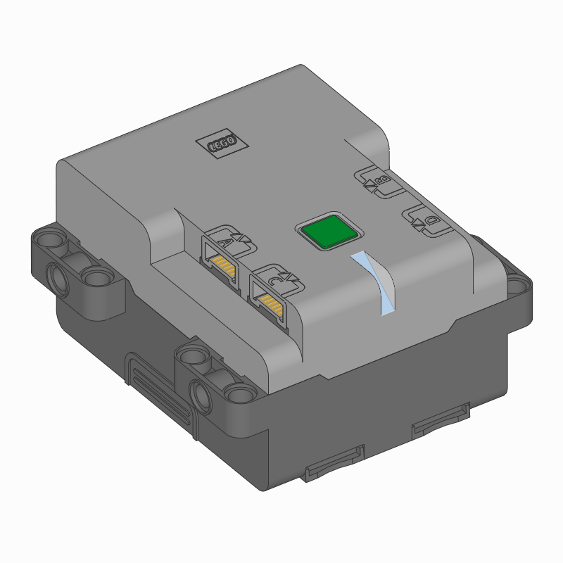

:mod:`hubs <pybricks.hubs>` -- Programmable Hubs
================================================

.. module:: pybricks.hubs

.. toctree::
   :maxdepth: 1
   :hidden:

   movehub
   cityhub
   technichub
   ev3brick

.. pybricks-classlink:: MoveHub

.. figure:: ../../api/images/movehub.png
    :height: 10 em
    :target: movehub.html

.. pybricks-classlink:: CityHub

.. figure:: ../../api/images/cityhub.png
    :height: 10 em
    :target: cityhub.html

.. pybricks-classlink:: TechnicHub

.. pybricks-classlink:: EV3Brick

.. figure:: ../../api/images/ev3brick.png
    :height: 10 em
    :target: ev3brick.html

