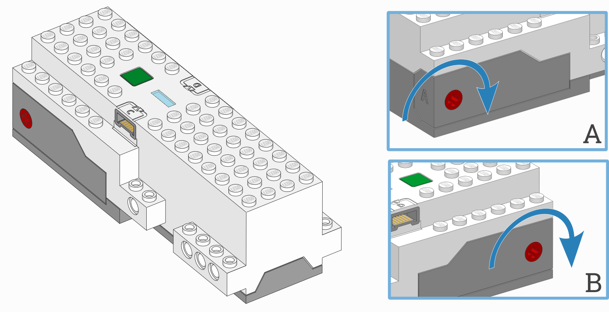

Move Hub
^^^^^^^^^^^^^^^^^^^^^^^^^^^^^^^

.. _fig_movehub:

.. autoclass:: pybricks.hubs.MoveHub
    :no-members:

    .. rubric:: Using the hub status light

    .. automethod:: pybricks.hubs::MoveHub.light.on

    .. automethod:: pybricks.hubs::MoveHub.light.off

    .. automethod:: pybricks.hubs::MoveHub.light.blink

    .. automethod:: pybricks.hubs::MoveHub.light.animate

    .. rubric:: Using the IMU

    .. automethod:: pybricks.hubs::MoveHub.imu.up

    .. automethod:: pybricks.hubs::MoveHub.imu.acceleration

    .. rubric:: Using the battery

    .. automethod:: pybricks.hubs::MoveHub.battery.voltage

    .. automethod:: pybricks.hubs::MoveHub.battery.current

    .. rubric:: System control

    .. automethod:: pybricks.hubs::MoveHub.system.reset

    .. automethod:: pybricks.hubs::MoveHub.system.reset_reason

    .. automethod:: pybricks.hubs::MoveHub.system.set_stop_button

Status light examples
---------------------

Turning the light on and off
******************************

.. literalinclude::
    ../../../examples/pup/hub_movehub/light_off.py

Making the light blink
******************************

.. literalinclude::
    ../../../examples/pup/hub_movehub/light_blink.py

IMU examples
---------------

Testing which way is up
********************************

.. literalinclude::
    ../../../examples/pup/hub_movehub/imu_up.py

Reading acceleration
**************************************************

.. literalinclude::
    ../../../examples/pup/hub_movehub/imu_read_acceleration.py
