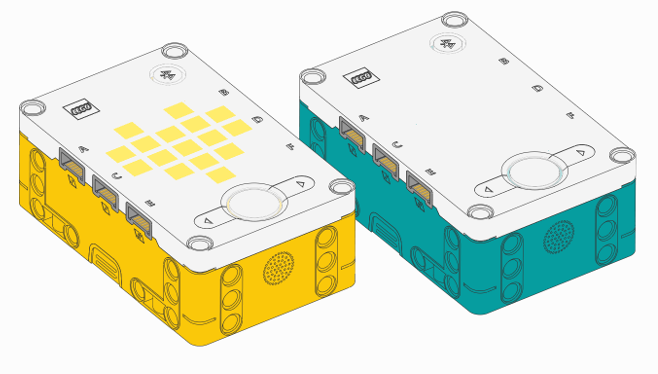

Prime Hub / Inventor Hub
^^^^^^^^^^^^^^^^^^^^^^^^^^^^^^^^^^^^^^^^^^^^^^^^^^^^^^^^^^^^^^^^^^^^^

.. class:: InventorHub

    This class is the same as the ``PrimeHub`` class, shown below. Both classes
    work on both hubs.

    These hubs are completely identical. They use the same Pybricks firmware.

.. autoclass:: pybricks.hubs.PrimeHub
    :no-members:

    .. rubric:: Using the hub status light

    .. figure:: ../../api/images/primehub_light_label.png
        :width: 22 em

    .. automethod:: pybricks.hubs::PrimeHub.light.on

    .. automethod:: pybricks.hubs::PrimeHub.light.off

    .. automethod:: pybricks.hubs::PrimeHub.light.blink

    .. automethod:: pybricks.hubs::PrimeHub.light.animate

    .. rubric:: Using the light matrix display

    .. figure:: ../../api/images/primehub_display_label.png
        :width: 22 em

    .. automethod:: pybricks.hubs::PrimeHub.display.orientation

    .. automethod:: pybricks.hubs::PrimeHub.display.off

    .. automethod:: pybricks.hubs::PrimeHub.display.pixel

    .. automethod:: pybricks.hubs::PrimeHub.display.image

    .. automethod:: pybricks.hubs::PrimeHub.display.animate

    .. automethod:: pybricks.hubs::PrimeHub.display.number

    .. automethod:: pybricks.hubs::PrimeHub.display.char

    .. automethod:: pybricks.hubs::PrimeHub.display.text

    .. rubric:: Using the buttons

    .. figure:: ../../api/images/primehub_buttons_label.png
        :width: 22 em

    .. automethod:: pybricks.hubs::PrimeHub.buttons.pressed

    .. rubric:: Using the IMU

    .. automethod:: pybricks.hubs::PrimeHub.imu.acceleration

    .. automethod:: pybricks.hubs::PrimeHub.imu.gyro

    .. rubric:: Using the speaker

    .. automethod:: pybricks.hubs::PrimeHub.speaker.beep

    .. automethod:: pybricks.hubs::PrimeHub.speaker.play_notes

    .. rubric:: Using the battery

    .. automethod:: pybricks.hubs::PrimeHub.battery.voltage

    .. automethod:: pybricks.hubs::PrimeHub.battery.current

.. note:: The examples below use the ``PrimeHub`` class. The examples work fine
          on both hubs because they are the identical. If you prefer, you can
          change this to ``InventorHub``.

Status light examples
---------------------

Turning the light on and off
****************************

.. literalinclude::
    ../../../examples/pup/hub_primehub/light_off.py

Changing brightness and using custom colors
*******************************************

.. literalinclude::
    ../../../examples/pup/hub_primehub/light_hsv.py

Making the light blink
**********************

.. literalinclude::
    ../../../examples/pup/hub_primehub/light_blink.py

Creating light animations
*************************

.. literalinclude::
    ../../../examples/pup/hub_primehub/light_animate.py

Matrix display examples
-----------------------

Displaying images
*****************

.. literalinclude::
    ../../../examples/pup/hub_primehub/display_image.py

Displaying numbers
******************

.. literalinclude::
    ../../../examples/pup/hub_primehub/display_number.py

Displaying text
***************

.. literalinclude::
    ../../../examples/pup/hub_primehub/display_text.py

Displaying individual pixels
****************************

.. literalinclude::
    ../../../examples/pup/hub_primehub/display_pixel.py

Changing the display orientation
********************************

.. literalinclude::
    ../../../examples/pup/hub_primehub/display_orientation.py

Making your own images
**********************

.. literalinclude::
    ../../../examples/pup/hub_primehub/display_matrix.py

Combining images to make expressions
************************************

.. literalinclude::
    ../../../examples/pup/hub_primehub/display_expression.py

Displaying animations
*********************

.. literalinclude::
    ../../../examples/pup/hub_primehub/display_animate.py

Button examples
---------------

Detecting button presses
************************

.. literalinclude::
    ../../../examples/pup/hub_primehub/button_main.py
