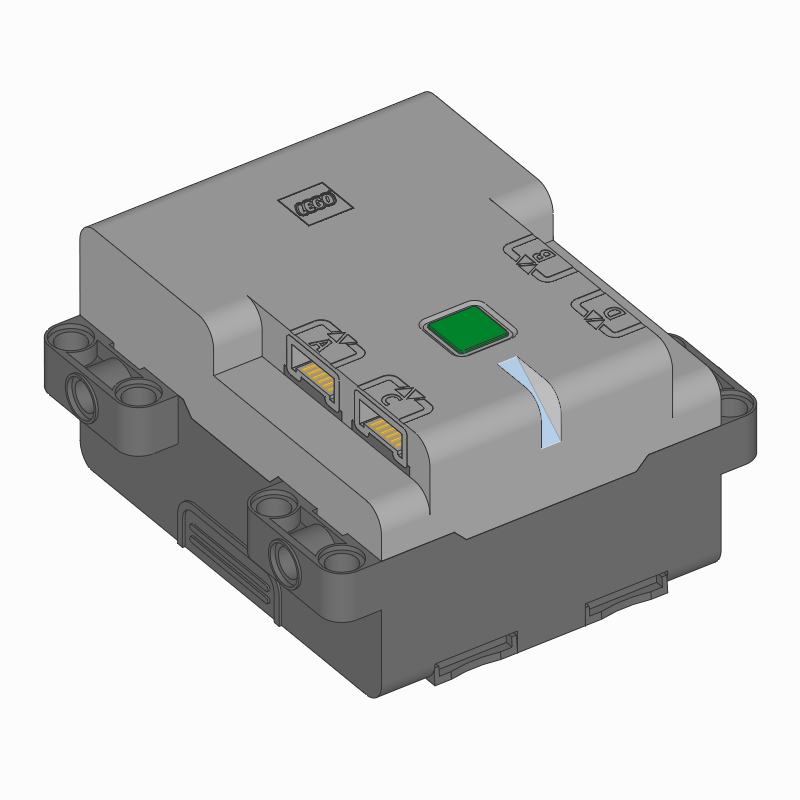

Technic Hub
^^^^^^^^^^^^^^^^^^^^^^^^^^^^^^^

.. autoclass:: pybricks.hubs.TechnicHub
    :no-members:

    .. rubric:: Using the hub status light

    .. automethod:: pybricks.hubs::TechnicHub.light.on

    .. automethod:: pybricks.hubs::TechnicHub.light.off

    .. automethod:: pybricks.hubs::TechnicHub.light.blink

    .. automethod:: pybricks.hubs::TechnicHub.light.animate

    .. rubric:: Using the battery

    .. automethod:: pybricks.hubs::TechnicHub.battery.voltage

    .. automethod:: pybricks.hubs::TechnicHub.battery.current

Status light examples
---------------------

Turning the light on and off
****************************

.. literalinclude::
    ../../../examples/pup/hub_technichub/light_off.py

Changing brightness and using custom colors
*******************************************

.. literalinclude::
    ../../../examples/pup/hub_technichub/light_hsv.py

Making the light blink
**********************

.. literalinclude::
    ../../../examples/pup/hub_technichub/light_blink.py

Creating light animations
*************************

.. literalinclude::
    ../../../examples/pup/hub_technichub/light_animate.py
