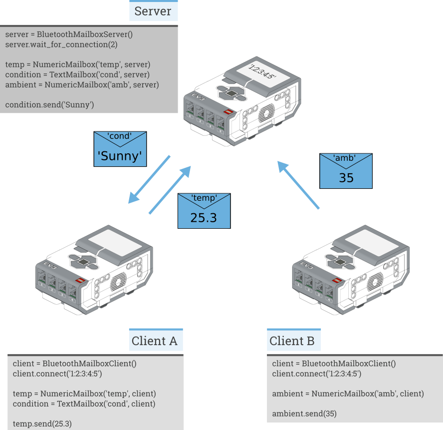

:mod:`messaging <pybricks.messaging>` -- Messaging
==================================================

.. automodule:: pybricks.messaging
    :no-members:

.. currentmodule:: pybricks.messaging

Introductory text. An example network is shown in :numref:`fig_messaging`.

.. _fig_messaging:

   An example network with one server and two clients.

Connections
------------

.. autoclass:: BluetoothMailboxServer

.. autoclass:: BluetoothMailboxClient

Mailboxes
---------

Mailboxes are used to send data to and from other EV3s.

.. autoclass:: Mailbox

.. autoclass:: LogicMailbox
    :no-members:

.. autoclass:: NumericMailbox
    :no-members:

.. autoclass:: TextMailbox
    :no-members:

