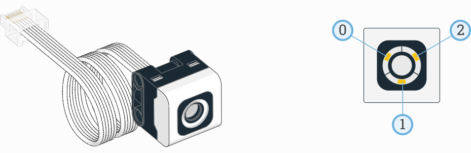

:mod:`pupdevices <pybricks.pupdevices>` -- Powered Up Devices
=============================================================

.. automodule:: pybricks.pupdevices
    :no-members:

Motors without Rotation Sensors
^^^^^^^^^^^^^^^^^^^^^^^^^^^^^^^

.. _fig_pupdcmotors:

.. figure:: ../api/images/pupdcmotors_label.png
   :width: 70 %
   :alt: pupmotors
   :align: center

   Powered Up motors without rotation sensors. The arrows indicate the default
   positive direction.

.. toggle-header::
    :header: **Show/hide examples**

    **Example 1: Making the motor move back and forth**

    .. literalinclude::
        ../../pybricks-projects/snippets/pup/motor_dc/motor_dc_init_basic.py

    **Example 2: Seting the positive direction as counterclockwise**

    .. literalinclude::
        ../../pybricks-projects/snippets/pup/motor_dc/motor_dc_init_direction.py

    **Example 3: Starting and stopping**

    .. literalinclude::
        ../../pybricks-projects/snippets/pup/motor_dc/motor_dc_stop.py

.. autoclass:: pybricks._common.DCMotor
    :noindex:
    :no-members:

    .. automethod:: pybricks._common.DCMotor.dc
        :noindex:

    .. automethod:: pybricks._common.DCMotor.stop
        :noindex:

    .. automethod:: pybricks._common.DCMotor.brake
        :noindex:

Motors with Rotation Sensors
^^^^^^^^^^^^^^^^^^^^^^^^^^^^

.. _fig_pupmotors:

.. figure:: ../api/images/pupmotors_label.png
   :width: 100 %
   :alt: pupmotors
   :align: left

   Powered Up motors with rotation sensors. The arrows indicate the default
   positive direction. See the :mod:`hubs <pybricks.hubs>` module for default
   directions of built-in motors.

.. autoclass:: pybricks.pupdevices.Motor
    :noindex:
    :no-members:

    .. toggle-header::
        :header: **Show/hide examples**

        **Example 1: Making the motor move back and forth**

        .. literalinclude::
            ../../pybricks-projects/snippets/pup/motor/motor_init_basic.py

        **Example 2: Using more than one motor**

        .. literalinclude::
            ../../pybricks-projects/snippets/pup/motor/motor_init_multiple.py

        **Example 3: Seting the positive direction as counterclockwise**

        .. literalinclude::
            ../../pybricks-projects/snippets/pup/motor/motor_init_direction.py

        **Example 4: Using gears**

        .. literalinclude::
            ../../pybricks-projects/snippets/pup/motor/motor_init_gears.py

    .. rubric:: Measuring

    .. toggle-header::
        :header: **Show/hide examples**

        **Example 1: Measuring the angle and speed**

        .. literalinclude::
            ../../pybricks-projects/snippets/pup/motor/motor_measure.py

        **Example 2: Resetting the measured angle**

        .. literalinclude::
            ../../pybricks-projects/snippets/pup/motor/motor_reset_angle.py

    .. automethod:: pybricks.pupdevices.Motor.speed

    .. automethod:: pybricks.pupdevices.Motor.angle

    .. automethod:: pybricks.pupdevices.Motor.reset_angle

    .. rubric:: Stopping

    .. toggle-header::
        :header: **Show/hide example**

        **Example: Stopping the motor in different ways**

        .. literalinclude::
            ../../pybricks-projects/snippets/pup/motor/motor_stop.py

    .. automethod:: pybricks.pupdevices.Motor.stop

    .. automethod:: pybricks.pupdevices.Motor.brake

    .. automethod:: pybricks.pupdevices.Motor.hold

    .. rubric:: Action

    .. toggle-header::
        :header: **Show/hide examples**

        **Example 1: Basic usage of all action methods**

        .. literalinclude::
            ../../pybricks-projects/snippets/pup/motor/motor_action_basic.py

        **Example 2: Using the** ``then`` **argument to change how a motor stops**

        .. literalinclude::
            ../../pybricks-projects/snippets/pup/motor/motor_action_then.py

        **Example 3: Using the** ``wait`` **argument to run motors in parallel**

        .. literalinclude::
            ../../pybricks-projects/snippets/pup/motor/motor_action_wait.py

        **Example 4: Waiting for two actions to complete in parallel**

        .. literalinclude::
            ../../pybricks-projects/snippets/pup/motor/motor_action_wait_advanced.py

        **Example 5: Running a motor until a mechanical endpoint**

        .. literalinclude::
            ../../pybricks-projects/snippets/pup/motor/motor_until_stalled.py

        **Example 6: Centering a steering mechanism**

        .. literalinclude::
            ../../pybricks-projects/snippets/pup/motor/motor_until_stalled.py

    .. automethod:: pybricks.pupdevices.Motor.run

    .. automethod:: pybricks.pupdevices.Motor.run_time

    .. automethod:: pybricks.pupdevices.Motor.run_angle

    .. automethod:: pybricks.pupdevices.Motor.run_target

    .. automethod:: pybricks.pupdevices.Motor.run_until_stalled

    .. automethod:: pybricks.pupdevices.Motor.dc

    .. rubric:: Advanced motion control

    .. automethod:: pybricks.pupdevices.Motor.track_target

    .. autoattribute:: pybricks.ev3devices.Motor.control
        :annotation:
        :noindex:

.. FIXME: above should point to pupdevices but inherited class attributes
   do not work yet (https://github.com/sphinx-doc/sphinx/issues/741).

Color and Distance Sensor
^^^^^^^^^^^^^^^^^^^^^^^^^

.. figure:: ../api/images/sensor_colordistance.png
   :width: 35 %

.. toggle-header::
    :header: **Show/hide examples**

    **Example 1: Measuring color**

    .. literalinclude::
        ../../pybricks-projects/snippets/pup/sensor_color_distance/color_print.py

    **Example 2: Waiting for a color**

    .. literalinclude::
        ../../pybricks-projects/snippets/pup/sensor_color_distance/wait_for_color.py

    **Example 3: Measuring distance**

    .. literalinclude::
        ../../pybricks-projects/snippets/pup/sensor_color_distance/distance_blink.py

.. autoclass:: pybricks.pupdevices.ColorDistanceSensor
    :no-members:

    .. automethod:: pybricks.pupdevices.ColorDistanceSensor.color

    .. automethod:: pybricks.pupdevices.ColorDistanceSensor.reflection

    .. automethod:: pybricks.pupdevices.ColorDistanceSensor.ambient

    .. automethod:: pybricks.pupdevices.ColorDistanceSensor.distance

    .. rubric:: Advanced color sensing

    .. toggle-header::
        :header: **Show/hide examples**

        **Example 1: Reading hue, saturation, and value**

        .. literalinclude::
            ../../pybricks-projects/snippets/pup/sensor_color_distance/hsv.py

        **Example 2: Modifying the default color map**

        .. literalinclude::
            ../../pybricks-projects/snippets/pup/sensor_color_distance/color_map_modify.py

        **Example 3: Providing a whole new color map**

        .. literalinclude::
            ../../pybricks-projects/snippets/pup/sensor_color_distance/color_map_new.py

    .. automethod:: pybricks.pupdevices.ColorDistanceSensor.hsv

    .. automethod:: pybricks.pupdevices.ColorDistanceSensor.color_map

    .. rubric:: Built-in light

    This sensor has a built-in light. You can make it red, green, blue, or turn
    it off. If you use the sensor to measure something afterwards, the light
    automatically turns back on at the default color for that sensing method.

    .. toggle-header::
        :header: **Show/hide examples**

        **Example: Blinking the built-in light**

        .. literalinclude::
            ../../pybricks-projects/snippets/pup/sensor_color_distance/distance_blink.py

    .. automethod:: pybricks.pupdevices::ColorDistanceSensor.light.on

    .. automethod:: pybricks.pupdevices::ColorDistanceSensor.light.off

    .. rubric:: Power Functions 1.0 Control

    .. automethod:: pybricks.pupdevices.ColorDistanceSensor.remote

Color Sensor
^^^^^^^^^^^^^^^^^^^^^^^^^

.. toggle-header::
    :header: **Show/hide examples**

    **Example 1: Measuring color and reflection**

    .. literalinclude::
        ../../pybricks-projects/snippets/pup/sensor_color/color_print.py

    **Example 2: Waiting for a color**

    .. literalinclude::
        ../../pybricks-projects/snippets/pup/sensor_color/wait_for_color.py

.. autoclass:: pybricks.pupdevices.ColorSensor
    :no-members:

    .. automethod:: pybricks.pupdevices.ColorSensor.color

    .. automethod:: pybricks.pupdevices.ColorSensor.reflection

    .. automethod:: pybricks.pupdevices.ColorSensor.ambient

    .. rubric:: Advanced color sensing

    .. toggle-header::
        :header: **Show/hide examples**

        **Example 1: Reading hue, saturation, and value**

        .. literalinclude::
            ../../pybricks-projects/snippets/pup/sensor_color/hsv.py

        **Example 2: Modifying the default color map**

        .. literalinclude::
            ../../pybricks-projects/snippets/pup/sensor_color/color_map_modify.py

        **Example 3: Providing a whole new color map**

        .. literalinclude::
            ../../pybricks-projects/snippets/pup/sensor_color/color_map_new.py

        **Example 4: Reading ambient hue, saturation, value, and color**

        .. literalinclude::
            ../../pybricks-projects/snippets/pup/sensor_color/color_ambient.py

    .. automethod:: pybricks.pupdevices.ColorSensor.hsv

    .. automethod:: pybricks.pupdevices.ColorSensor.color_map

    .. rubric:: Built-in lights

    This sensor has 3 built-in lights. You can adjust the brightness of each
    light. If you use the sensor to measure something, the lights will
    be turned on or off as needed for the measurement.

    .. toggle-header::
        :header: **Show/hide examples**

        **Example: Blinking the built-in lights**

        .. literalinclude::
            ../../pybricks-projects/snippets/pup/sensor_color/lights_blink.py

    .. automethod:: pybricks.pupdevices::ColorSensor.lights.on

    .. automethod:: pybricks.pupdevices::ColorSensor.lights.off

Ultrasonic Sensor
^^^^^^^^^^^^^^^^^^^^^^^^^

.. figure:: ../api/images/sensor_ultrasonic_lights_label.png
   :width: 80 %

.. toggle-header::
    :header: **Show/hide examples**

    **Example 1: Measuring distance and switching on the lights**

    .. literalinclude::
        ../../pybricks-projects/snippets/pup/sensor_ultrasonic/basics.py

    **Example 2: Using math to gradually change the brightness of the lights**

    .. literalinclude::
        ../../pybricks-projects/snippets/pup/sensor_ultrasonic/math.py

.. autoclass:: pybricks.pupdevices.UltrasonicSensor
    :no-members:

    .. automethod:: pybricks.pupdevices.UltrasonicSensor.distance

    .. automethod:: pybricks.pupdevices.UltrasonicSensor.presence

    .. rubric:: Built-in lights

    This sensor has 4 built-in lights. You can adjust the brightness of each
    light.

    .. automethod:: pybricks.pupdevices::UltrasonicSensor.lights.on

    .. automethod:: pybricks.pupdevices::UltrasonicSensor.lights.off

Force Sensor
^^^^^^^^^^^^^^^^^^^^^^^^^

.. figure:: ../api/images/sensor_force.png
   :width: 35 %

.. toggle-header::
    :header: **Show/hide examples**

    **Example 1: Measuring force and movement**

    .. literalinclude::
        ../../pybricks-projects/snippets/pup/sensor_force/basics.py

    **Example 2: Measuring peak force**

    .. literalinclude::
        ../../pybricks-projects/snippets/pup/sensor_force/peak.py

.. autoclass:: pybricks.pupdevices.ForceSensor
    :no-members:

    .. automethod:: pybricks.pupdevices.ForceSensor.force

    .. automethod:: pybricks.pupdevices.ForceSensor.distance

    .. automethod:: pybricks.pupdevices.ForceSensor.pressed

    .. automethod:: pybricks.pupdevices.ForceSensor.touched

Infrared Sensor
^^^^^^^^^^^^^^^^^^^^^^^^^

.. figure:: ../api/images/sensor_proximity.png
   :width: 35 %

.. toggle-header::
    :header: **Show/hide example**

    **Example: Measuring distance, object count, and reflection**

    .. literalinclude::
        ../../pybricks-projects/snippets/pup/sensor_infrared/basics.py

.. autoclass:: pybricks.pupdevices.InfraredSensor
    :no-members:

    .. automethod:: pybricks.pupdevices.InfraredSensor.distance

    .. automethod:: pybricks.pupdevices.InfraredSensor.reflection

    .. automethod:: pybricks.pupdevices.InfraredSensor.count

Tilt Sensor
^^^^^^^^^^^^^^^^^^^^^^^^^

.. figure:: ../api/images/sensor_tilt.png
   :width: 35 %

.. toggle-header::
    :header: **Show/hide example**

    **Example: Measuring pitch and roll**

    .. literalinclude::
        ../../pybricks-projects/snippets/pup/sensor_tilt/basics.py

.. autoclass:: pybricks.pupdevices.TiltSensor
    :no-members:

    .. automethod:: tilt

..    .. automethod:: neutral

..    .. automethod:: acceleration

..    .. automethod:: up

.. Remote Control
.. ^^^^^^^^^^^^^^^^^^^^^^^^^

.. .. autoclass:: pybricks.pupdevices.RemoteControl
    :no-members:

    .. automethod:: pybricks.pupdevices::RemoteControl.light.on

    .. automethod:: pybricks.pupdevices::RemoteControl.light.off

    .. automethod:: pybricks.pupdevices::RemoteControl.buttons.pressed

Light
^^^^^^^^^^^^^^^^^^^^^^^^^

.. figure:: ../api/images/light.png
   :width: 90 %

.. toggle-header::
    :header: **Show/hide examples**

    **Example 1: Making the light blink**

    .. literalinclude::
        ../../pybricks-projects/snippets/pup/light/basics.py

    **Example 2: Using math to gradually change the brightness of the light**

    .. literalinclude::
        ../../pybricks-projects/snippets/pup/light/math.py

.. autoclass:: pybricks.pupdevices.Light
    :no-members:

    .. automethod:: pybricks.pupdevices.Light.on

    .. automethod:: pybricks.pupdevices.Light.off

..    .. automethod:: pybricks.pupdevices.Light.pattern
