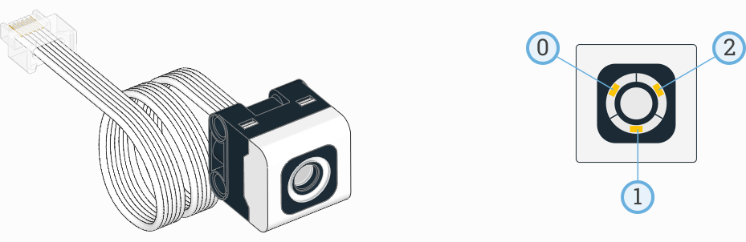

Color Sensor
^^^^^^^^^^^^^^^^^^^^^^^^^

.. toggle-header::
    :header: **Show/hide examples**

    **Example 1: Measuring color and reflection**

    .. literalinclude::
        ../../../examples/pup/sensor_color/color_print.py

    **Example 2: Waiting for a color**

    .. literalinclude::
        ../../../examples/pup/sensor_color/wait_for_color.py

.. autoclass:: pybricks.pupdevices.ColorSensor
    :no-members:

    .. automethod:: pybricks.pupdevices.ColorSensor.color

    .. automethod:: pybricks.pupdevices.ColorSensor.reflection

    .. automethod:: pybricks.pupdevices.ColorSensor.ambient

    .. rubric:: Advanced color sensing

    .. toggle-header::
        :header: **Show/hide examples**

        **Example 1: Reading hue, saturation, and value**

        .. literalinclude::
            ../../../examples/pup/sensor_color/hsv.py

        **Example 2: Changing the detectable colors**

        By default, the sensor is configured to detect red, yellow, green,
        blue, white, or ``None``, which suits many applications.

        For better results in your application, you can measure your desired
        colors in advance, and tell the sensor to look only for those colors.
        Be sure to measure them at the **same distance and light conditions**
        as in your final application. Then you'll get very accurate results
        even for colors that are otherwise hard to detect.

        .. literalinclude::
            ../../../examples/pup/sensor_color/detectable_colors.py

        **Example 3: Reading ambient hue, saturation, value, and color**

        .. literalinclude::
            ../../../examples/pup/sensor_color/color_ambient.py

    .. automethod:: pybricks.pupdevices.ColorSensor.hsv

    .. automethod:: pybricks.pupdevices.ColorSensor.detectable_colors

    .. rubric:: Built-in lights

    This sensor has 3 built-in lights. You can adjust the brightness of each
    light. If you use the sensor to measure something, the lights will
    be turned on or off as needed for the measurement.

    .. toggle-header::
        :header: **Show/hide examples**

        **Example: Blinking the built-in lights**

        .. literalinclude::
            ../../../examples/pup/sensor_color/lights_blink.py

    .. automethod:: pybricks.pupdevices::ColorSensor.lights.on

    .. automethod:: pybricks.pupdevices::ColorSensor.lights.off
