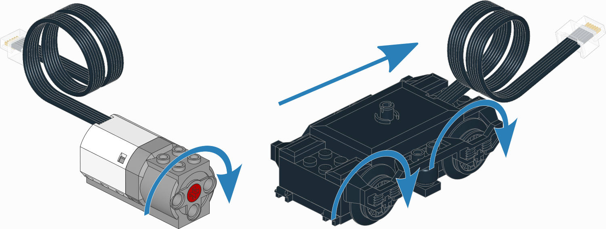
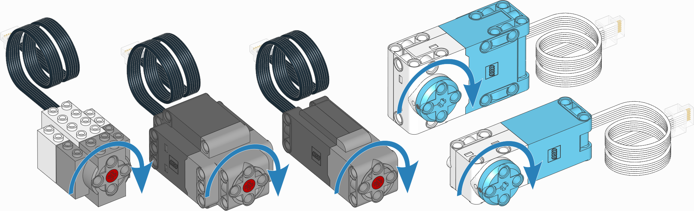
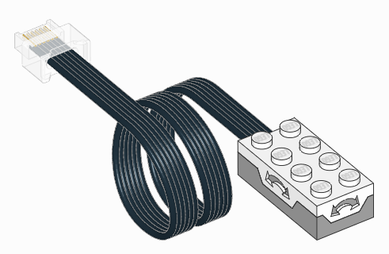
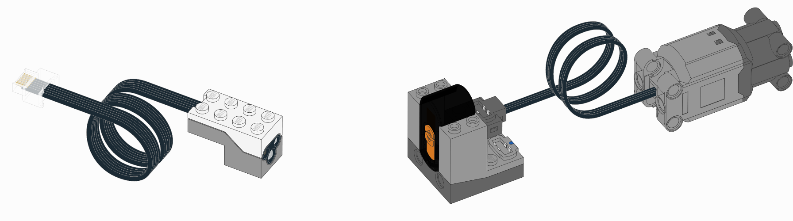
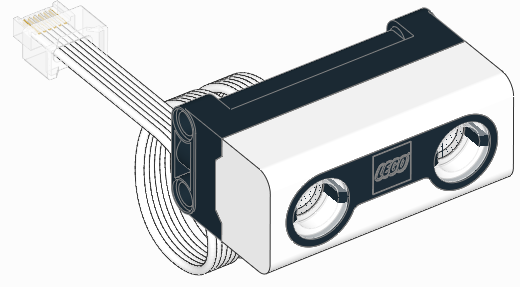
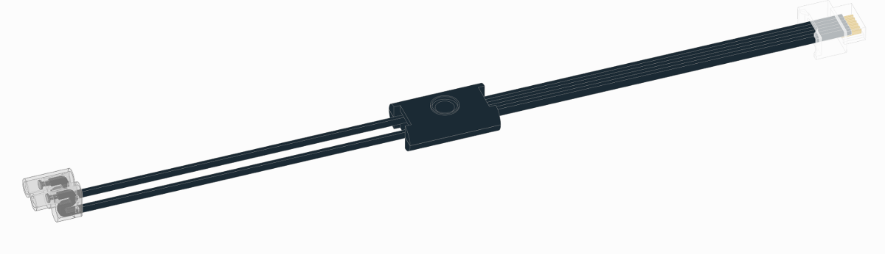
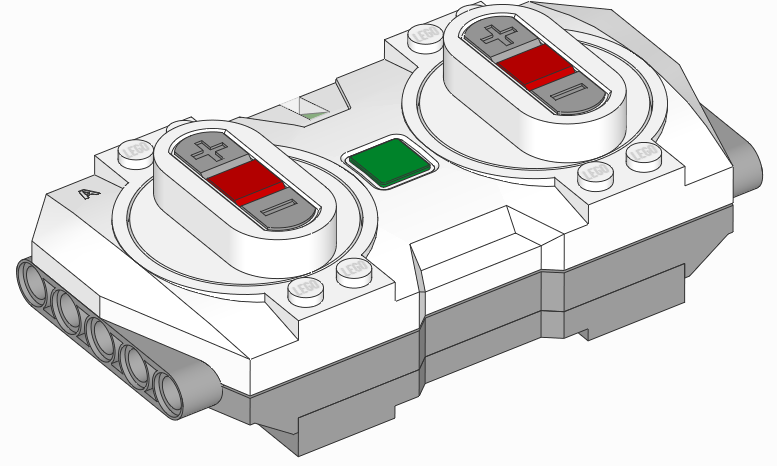

:mod:`pupdevices <pybricks.pupdevices>` -- Powered Up Devices
=============================================================

.. automodule:: pybricks.pupdevices
    :no-members:

.. toctree::
   :maxdepth: 1
   :hidden:

   dcmotor
   motor
   tiltsensor
   infraredsensor
   colordistancesensor
   pfmotor
   colorsensor
   ultrasonicsensor
   forcesensor
   light
   remote

.. class:: DCMotor
    :noindex:

.. class:: Motor
    :noindex:

.. class:: TiltSensor
    :noindex:

.. class:: InfraredSensor
    :noindex:

.. figure:: ../../api/images/sensor_proximity.png
   :width: 35 %
   :target: infraredsensor.html

.. class:: ColorDistanceSensor
    :noindex:

.. figure:: ../../api/images/sensor_colordistance.png
   :width: 32 %
   :target: colordistancesensor.html

.. class:: PFMotor
    :noindex:

.. class:: ColorSensor
    :noindex:

.. figure:: ../../api/images/sensor_color.png
   :width: 32 %
   :target: colorsensor.html

.. class:: UltrasonicSensor
    :noindex:

.. class:: ForceSensor
    :noindex:

.. figure:: ../../api/images/sensor_force.png
   :width: 35 %
   :target: forcesensor.html

.. class:: Light
    :noindex:

.. class:: Remote
    :noindex:

