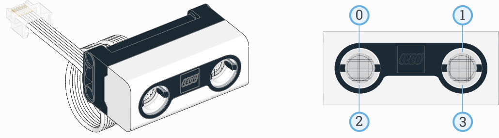

Ultrasonic Sensor
^^^^^^^^^^^^^^^^^^^^^^^^^

.. toggle-header::
    :header: **Show/hide examples**

    **Example 1: Measuring distance and switching on the lights**

    .. literalinclude::
        ../../../examples/pup/sensor_ultrasonic/basics.py

    **Example 2: Using math to gradually change the brightness of the lights**

    .. literalinclude::
        ../../../examples/pup/sensor_ultrasonic/math.py

.. autoclass:: pybricks.pupdevices.UltrasonicSensor
    :no-members:

    .. automethod:: pybricks.pupdevices.UltrasonicSensor.distance

    .. automethod:: pybricks.pupdevices.UltrasonicSensor.presence

    .. rubric:: Built-in lights

    This sensor has 4 built-in lights. You can adjust the brightness of each
    light.

    .. automethod:: pybricks.pupdevices::UltrasonicSensor.lights.on

    .. automethod:: pybricks.pupdevices::UltrasonicSensor.lights.off
