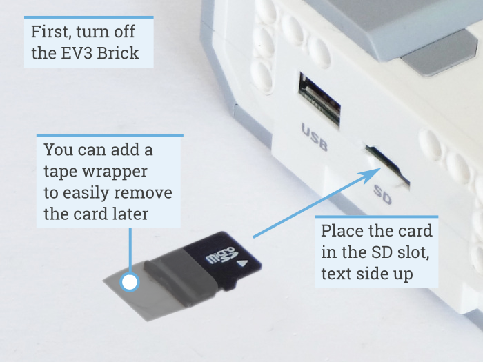
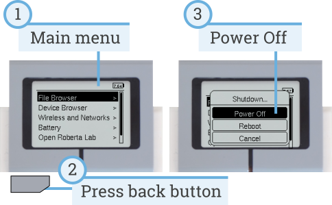
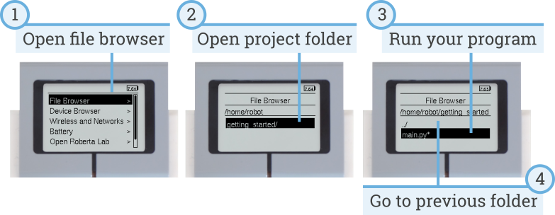

Using the EV3 Brick
===================

Make sure the EV3 Brick is turned off. Insert the microSD card you prepared
into the microSD card slot on the EV3 Brick, as shown in :numref:`fig_sd`.

.. _fig_sd:

   Inserting the flashed microSD card into the EV3 Brick

Turning the EV3 Brick on and off
-----------------------------------------------------------

Turn on the EV3 Brick by pressing the dark gray center button.

The boot process may take several minutes. While booting, the EV3 Brick status
light turns orange and blinks intermittently, and you'll see a lot of text on
the EV3 screen. The EV3 Brick is ready for use when the status light turns
green.

To turn the EV3 Brick off, open the shutdown menu with the back button, and
then select *Power Off* using the center button, as shown
in :numref:`fig_onoff`.

.. _fig_onoff:

   Turning the EV3 Brick off

Viewing motor and sensor values
-----------------------------------------------------------

When you're not running a program, you can view motor and sensor values using
the device browser, as shown in :numref:`fig_devicebrowser`.

.. _fig_devicebrowser:

.. figure:: ../../api/images/devicebrowser_label.png
   :width: 100 %
   :alt: devicebrowser
   :align: center

   Viewing motor and sensor values

Running a program without a computer
-----------------------------------------------------------

You can run previously downloaded programs directly from the EV3 Brick.

To do so, find the program using the *file browser* on the EV3 screen and press
the center button key to start the program as shown in :numref:`fig_manualrun`.

.. _fig_manualrun:

   Starting a program using the buttons on the EV3 Brick

Going back to the original firmware
-----------------------------------------------------------

You can go back to the LEGO® firmware and your LEGO programs at any time. To
do so:

1. Turn the EV3 Brick off as shown above.
2. Wait for the screen and brick status light to turn off.
3. Remove the microSD card.
4. Turn the EV3 on.
