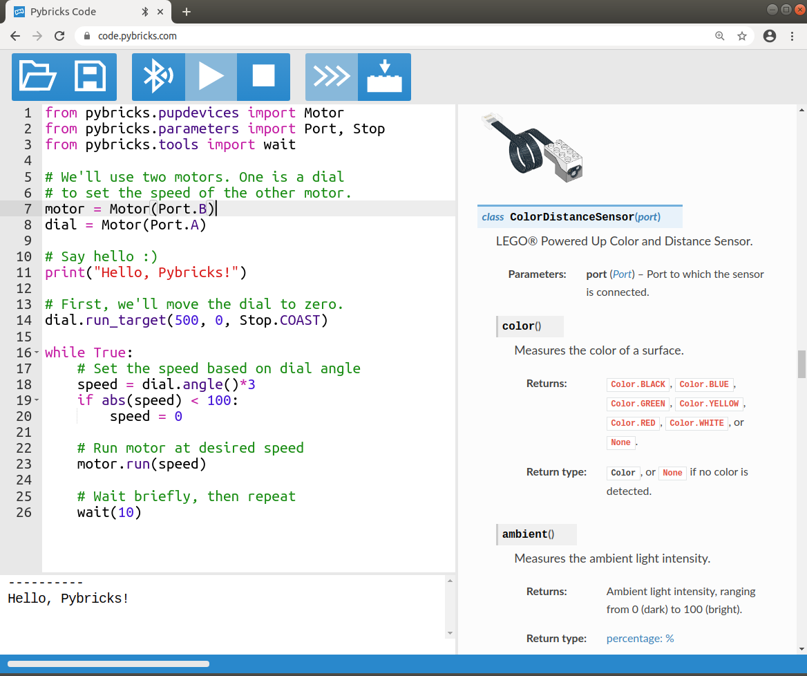

Powered Up Quick Start
########################

This page shows how you can install Pybricks on your hub and run your first
program. When you're ready, browse through the Pybricks Modules in the left
hand menu to modify the example program.

.. note::

    - We welcome your questions, feedback and bug reports on our `support page`_.

    - **This is still in beta! Not everything may work as expected yet.**

    - Main current bugs/limitations:

       - Sensors/motors are detected automatically only once. So if you change
         the cables, you have to turn the hub off and on again. You can turn it
         off by holding down the button for about 5 seconds.

       - On the BOOST Move Hub, ports C and D do not work yet.

Installing Google Chrome 85
--------------------------------------

Writing Pybricks programs requires a web browser with up-to-date web Bluetooth
functionality. Currently, only Google Chrome supports this. You need at least
version 85.

Download Google Chrome 85 beta `from here`_.

The official Chrome 85 release is scheduled for August 25th. For now you can
install this beta on Windows, Mac, and Linux without affecting your existing
browsers.

.. toggle-header::
    :header: **Show/hide extra steps for Linux users**

    - In Google Chrome go to ``chrome://flags/``.
    - Search for *Experimental Web Platform features* and enable it.
    - Installing firmware will be slow if you have BlueZ < v5.51.
      Check your version: ``bluetoothd -v``.

Installing the Pybricks firmware
--------------------------------

Pybricks uses an improved firmware that can run autonomous programs.
Installing it is easy:

1. Make sure you use fresh batteries.
2. Unplug all motors and sensors.
3. Follow the steps in the video below.

.. toggle-header::
    :header: **Click to show/hide written step-by-step instructions.**

    - Make sure you use fresh batteries.
    - Unplug all motors and sensors.
    - Make sure the hub is off.
    - Press and hold the green button.
    - Wait for the light to blink, but keep holding the button.
    - On the Pybricks Code page, click the firmware update button.
    - Select the ``LEGO Bootloader`` and click *Pair*.
    - The light should change to a red/green/blue sequence.
    - You can now release the button.
    - Wait for the update to finish, indicated by a steady blue light.
    - If you use the recommended browser, this will take about 90 seconds.

.. raw:: html

    <video controls src="https://pybricks.com/wp-content/uploads/2020/06/install.mp4" width="100%"></video>
     

Running programs
--------------------------------

Once the firmware is installed, you can start coding! Use the *Bluetooth*
button to search for and connect to your *Pybricks Hub*. Then press run to
start your program.

To get started, just copy and paste this snippet::

    from pybricks.pupdevices import Motor
    from pybricks.parameters import Port, Stop
    from pybricks.tools import wait

    # We'll use two motors. One is a dial
    # to set the speed of the other motor.
    motor = Motor(Port.B)
    dial = Motor(Port.A)

    # Say hello :)
    print("Hello, Pybricks!")

    # First, we'll move the dial to zero.
    dial.run_target(500, 0, Stop.COAST)

    while True:
        # Set the speed based on dial angle
        speed = dial.angle()*3
        if abs(speed) < 100:
            speed = 0

        # Run motor at desired speed
        motor.run(speed)

        # Wait briefly, then repeat
        wait(10)

.. toggle-header::
    :header: **Show/hide beta steps to save a program permanently**

    **Saving a program permanently (BETA)**

    .. note::

        - This functionality is in beta. It is currently only recommended for
          advanced users. In the long run, we'll make this easy to do with
          the online editor.
        - All LEGO motors and sensors need a few seconds to boot. You don't
          normally notice because you spend that time connecting. But this is
          way faster. So if you experience problems, give your hub a few
          seconds before you start your program.

    When you run a program the normal way, it is deleted as soon as it's done.
    That's because Powered Up hubs don't have a file system to store programs.
    Fortunately, you can still save a script on the hub by including it
    in the firmware.

    Of course, this is a bit slow to do every time. We recommend the
    using the standard procedure most of the time.
    When you're happy with your final program, you can save it permanently as
    described below. To change the program, just repeat these steps:

    1. Sign in to GitHub.
    2. Go to our `GitHub commits`_.
    3. Click on the green checkmark next to the latest
       commit. On the dialog that pops up, click `details`.
    4. Then click `Artifacts` on the right hand side of the page.
    5. Download the firmware for your hub. The firmware is a ZIP archive
       containing the basic firmware and one ``main.py`` script.
    6. Modify the ``main.py`` file as you like.
    7. Drag your modified ZIP file *onto* the firmware update button of the
       online editor.
    8. The update now proceeds as usual.

    *Once installed, you can start that program with the green button.
    No connection required!*

Restoring the LEGO Firmware
---------------------------

Pybricks uses the same update method as the LEGO apps; just with a different
firmware file. This means you can go back to the original firmware any time.
As shown in the video below, just put the hub in update mode and
connect using a LEGO app.

This video shows the Powered Up app in *create* mode. It has firmware for all
hubs. As usual, you may need to restart the app to detect the hub. If it fails,
try again with fresh batteries.

.. raw:: html

    <video controls src="https://pybricks.com/wp-content/uploads/2020/06/restore.mp4" width="100%"></video>

.. _GitHub commits: https://github.com/pybricks/pybricks-micropython/commits/master
.. _support page: https://github.com/pybricks/support/issues/
.. _Pybricks Code: http://code.pybricks.com/
.. _from here: https://www.google.com/chrome/dev/
