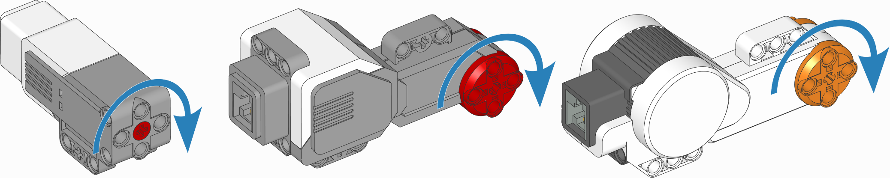
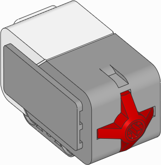

:mod:`ev3devices <pybricks.ev3devices>` -- EV3 Devices
======================================================

.. automodule:: pybricks.ev3devices
    :no-members:

Motors
^^^^^^^^^^^^

.. _fig_ev3motors:

   EV3-compatible motors. The arrows indicate the default positive direction.

.. autoclass:: pybricks.ev3devices.Motor
    :noindex:
    :no-members:

    .. rubric:: Measuring

    .. automethod:: pybricks.ev3devices.Motor.speed

    .. automethod:: pybricks.ev3devices.Motor.angle

    .. automethod:: pybricks.ev3devices.Motor.reset_angle

    .. rubric:: Stopping

    .. automethod:: pybricks.ev3devices.Motor.stop

    .. automethod:: pybricks.ev3devices.Motor.brake

    .. automethod:: pybricks.ev3devices.Motor.hold

    .. rubric:: Action

    .. automethod:: pybricks.ev3devices.Motor.run

    .. automethod:: pybricks.ev3devices.Motor.run_time

    .. automethod:: pybricks.ev3devices.Motor.run_angle

    .. automethod:: pybricks.ev3devices.Motor.run_target

    .. automethod:: pybricks.ev3devices.Motor.run_until_stalled

    .. automethod:: pybricks.ev3devices.Motor.dc

    .. rubric:: Advanced motion control

    .. automethod:: pybricks.ev3devices.Motor.track_target

    .. autoattribute:: pybricks.ev3devices.Motor.control
        :annotation:

Touch Sensor
^^^^^^^^^^^^

.. autoclass:: pybricks.ev3devices.TouchSensor

Color Sensor
^^^^^^^^^^^^

.. figure:: ../main/images/sensor_ev3_color.png
   :width: 18 %

.. autoclass:: pybricks.ev3devices.ColorSensor

Infrared Sensor and Beacon
^^^^^^^^^^^^^^^^^^^^^^^^^^

Each method of this class puts the sensor in a different *mode*. Switching
modes takes about one second on this sensor. To make sure that your program
runs quickly, use only of these methods in your program.

.. figure:: ../main/images/sensor_ev3_ir.png
   :width: 60 %

.. autoclass:: pybricks.ev3devices.InfraredSensor

Ultrasonic Sensor
^^^^^^^^^^^^^^^^^

.. figure:: ../main/images/sensor_ev3_ultrasonic.png
   :width: 22 %

.. autoclass:: pybricks.ev3devices.UltrasonicSensor

Gyroscopic Sensor
^^^^^^^^^^^^^^^^^

.. figure:: ../main/images/sensor_ev3_gyro.png
   :width: 18 %

.. autoclass:: pybricks.ev3devices.GyroSensor
    :no-members:

    .. automethod:: pybricks.ev3devices.GyroSensor.speed

    .. automethod:: pybricks.ev3devices.GyroSensor.angle

         If you use the :meth:`.angle` method, you cannot use the
         :meth:`.speed` method in the same program. Doing so would reset the
         sensor angle to zero every time you read the speed.

    .. automethod:: pybricks.ev3devices.GyroSensor.reset_angle
