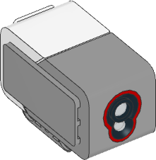

.. pybricks-requirements:: ev3devices

Color Sensor
^^^^^^^^^^^^^^^^^^^^^^^^^

.. blockimg:: pybricks_variables_set_ev3_color_sensor_ev3colorsensor_default

.. blockimg:: pybricks_variables_set_ev3_color_sensor_ev3colorsensor_detectable_colors

.. autoclass:: pybricks.ev3devices.ColorSensor
    :no-members:

    .. blockimg:: pybricks_blockColor_EV3ColorSensor_color

    .. automethod:: pybricks.ev3devices.ColorSensor.color

    .. blockimg:: pybricks_blockLightAmbient_EV3ColorSensor

    .. automethod:: pybricks.ev3devices.ColorSensor.ambient

    .. blockimg:: pybricks_blockLightReflection_EV3ColorSensor

    .. automethod:: pybricks.ev3devices.ColorSensor.reflection

    .. automethod:: pybricks.ev3devices.ColorSensor.rgb

    .. rubric:: Advanced color sensing

    .. blockimg:: pybricks_blockColor_EV3ColorSensor_hsv

    .. automethod:: pybricks.ev3devices.ColorSensor.hsv

    .. automethod:: pybricks.ev3devices.ColorSensor.detectable_colors
