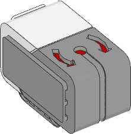

.. pybricks-requirements:: ev3devices

Gyroscopic Sensor
^^^^^^^^^^^^^^^^^

.. autoclass:: pybricks.ev3devices.GyroSensor
    :no-members:

    .. automethod:: pybricks.ev3devices.GyroSensor.speed

    .. automethod:: pybricks.ev3devices.GyroSensor.angle

    .. automethod:: pybricks.ev3devices.GyroSensor.reset_angle
