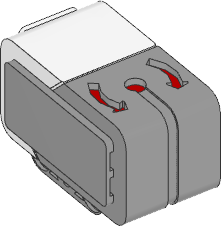

.. pybricks-requirements:: ev3devices

Gyroscopic Sensor
^^^^^^^^^^^^^^^^^

.. blockimg:: pybricks_variables_set_ev3_gyro_sensor

.. autoclass:: pybricks.ev3devices.GyroSensor
    :no-members:

    .. blockimg:: pybricks_blockImuRotation_EV3GyroSensor_imu.angular_velocity

    .. automethod:: pybricks.ev3devices.GyroSensor.speed

    .. blockimg:: pybricks_blockImuGetHeading_EV3GyroSensor

    .. blockimg:: pybricks_blockImuRotation_EV3GyroSensor_imu.rotation

    .. automethod:: pybricks.ev3devices.GyroSensor.angle

    .. blockimg:: pybricks_blockImuResetHeading_EV3GyroSensor

    .. automethod:: pybricks.ev3devices.GyroSensor.reset_angle
