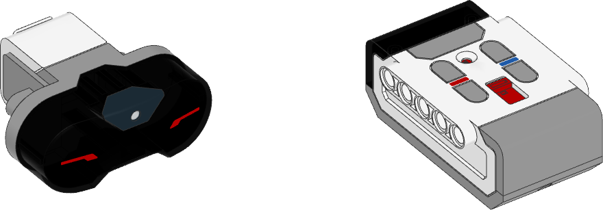

.. pybricks-requirements:: ev3

Infrared Sensor and Beacon
^^^^^^^^^^^^^^^^^^^^^^^^^^

Each method of this class puts the sensor in a different *mode*. Switching
modes takes about one second on this sensor. To make sure that your program
runs quickly, use only one of these methods in your program.

.. autoclass:: pybricks.ev3devices.InfraredSensor
