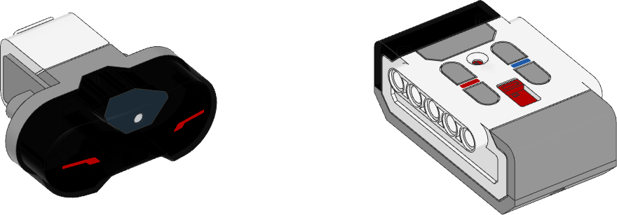

.. pybricks-requirements:: ev3devices

Infrared Sensor and Beacon
^^^^^^^^^^^^^^^^^^^^^^^^^^

Each method of this class puts the sensor in a different *mode*. Switching
modes takes about one second on this sensor. To make sure that your program
runs quickly, use only one of these methods in your program.

.. blockimg:: pybricks_variables_set_ev3_infrared_beacon

.. blockimg:: pybricks_variables_set_ev3_infrared_sensor

.. autoclass:: pybricks.ev3devices.InfraredSensor
    :no-members:

    .. blockimg:: pybricks_blockDistance_EV3InfraredSensor

    .. automethod:: pybricks.ev3devices.InfraredSensor.distance

    .. blockimg:: pybricks_blockDistance_EV3InfraredBeacon

    .. blockimg:: pybricks_blockImuGetHeading_EV3InfraredBeacon

    .. automethod:: pybricks.ev3devices.InfraredSensor.beacon

    .. blockimg:: pybricks_blockButtonIsPressed_EV3InfraredBeacon

    .. automethod:: pybricks.ev3devices.InfraredSensor.buttons

    .. automethod:: pybricks.ev3devices.InfraredSensor.keypad
