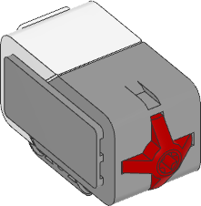

.. pybricks-requirements:: ev3devices

Touch Sensor
^^^^^^^^^^^^^^^^^^^^^^^^^

.. blockimg:: pybricks_variables_set_ev3_touch_sensor

.. autoclass:: pybricks.ev3devices.TouchSensor
    :no-members:

    .. blockimg:: pybricks_blockSensorPressed_EV3TouchSensor_pressed

    .. blockimg:: pybricks_blockSensorPressed_EV3TouchSensor_released

    .. automethod:: pybricks.ev3devices.TouchSensor.pressed
