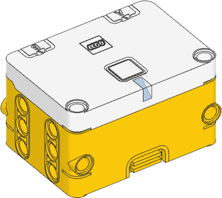

.. pybricks-requirements:: essentialhub

Essential Hub
^^^^^^^^^^^^^^^^^^^^^^^^^^^^^^^^^^^^^^^^^^^^^^^^^^^^^^^^^^^^^^^^^^^^^

.. note:: Pybricks support for this hub is in beta.
            Check the `installation instructions`_ to try it out.
            The following functions may change before the final release.

.. _installation instructions: https://pybricks.com/install/

.. autoclass:: pybricks.hubs.EssentialHub
    :no-members:

    .. rubric:: Using the hub status light

    .. automethod:: pybricks.hubs::EssentialHub.light.on

    .. automethod:: pybricks.hubs::EssentialHub.light.off

    .. automethod:: pybricks.hubs::EssentialHub.light.blink

    .. automethod:: pybricks.hubs::EssentialHub.light.animate

    .. rubric:: Using the button

    .. automethod:: pybricks.hubs::EssentialHub.button.pressed

    .. rubric:: Using the IMU

    .. automethod:: pybricks.hubs::EssentialHub.imu.up

    .. automethod:: pybricks.hubs::EssentialHub.imu.tilt

    .. automethod:: pybricks.hubs::EssentialHub.imu.acceleration

    .. automethod:: pybricks.hubs::EssentialHub.imu.angular_velocity

    .. automethod:: pybricks.hubs::EssentialHub.imu.heading

    .. automethod:: pybricks.hubs::EssentialHub.imu.reset_heading

    .. rubric:: Using the battery

    .. automethod:: pybricks.hubs::EssentialHub.battery.voltage

    .. automethod:: pybricks.hubs::EssentialHub.battery.current

    .. rubric:: Getting the charger status

    .. automethod:: pybricks.hubs::EssentialHub.charger.connected

    .. automethod:: pybricks.hubs::EssentialHub.charger.current

    .. automethod:: pybricks.hubs::EssentialHub.charger.status

    .. rubric:: System control

    .. automethod:: pybricks.hubs::EssentialHub.system.set_stop_button

    .. automethod:: pybricks.hubs::EssentialHub.system.name

    .. automethod:: pybricks.hubs::EssentialHub.system.storage

        You can store up to 512 bytes of data on this hub.

    .. automethod:: pybricks.hubs::EssentialHub.system.shutdown

    .. automethod:: pybricks.hubs::EssentialHub.system.reset_reason

Status light examples
---------------------

Turning the light on and off
****************************

.. literalinclude::
    ../../../examples/pup/hub_common/build/light_off_essentialhub.py

Changing brightness and using custom colors
*******************************************

.. literalinclude::
    ../../../examples/pup/hub_common/build/light_hsv_essentialhub.py

Making the light blink
**********************

.. literalinclude::
    ../../../examples/pup/hub_common/build/light_blink_essentialhub.py

Creating light animations
*************************

.. literalinclude::
    ../../../examples/pup/hub_common/build/light_animate_essentialhub.py

IMU examples
---------------

Testing which way is up
********************************

.. literalinclude::
    ../../../examples/pup/hub_common/build/imu_up_essentialhub.py

Reading the tilt value
********************************

.. literalinclude::
    ../../../examples/pup/hub_common/build/imu_tilt_essentialhub.py

Using a custom hub orientation
**************************************************

.. literalinclude::
    ../../../examples/pup/hub_common/build/imu_tilt_blast_essentialhub.py

Reading acceleration and angular velocity vectors
**************************************************

.. literalinclude::
    ../../../examples/pup/hub_common/build/imu_read_vector_essentialhub.py

Reading acceleration and angular velocity on one axis
*****************************************************

.. literalinclude::
    ../../../examples/pup/hub_common/build/imu_read_scalar_essentialhub.py

System examples
----------------------------------

Using the stop button during your program
*****************************************

.. literalinclude::
    ../../../examples/pup/hub_common/build/button_single_essentialhub.py

Turning the hub off
*****************************************

.. literalinclude::
    ../../../examples/pup/hub_common/build/system_shutdown_essentialhub.py
