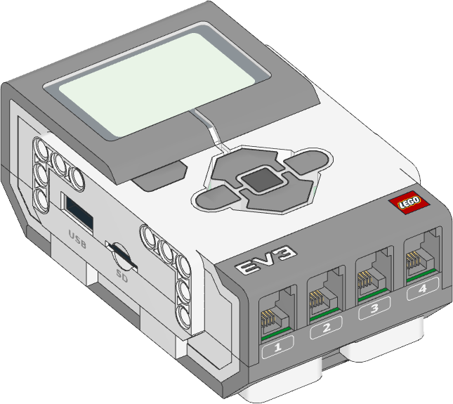

MINDSTORMS EV3 Brick
^^^^^^^^^^^^^^^^^^^^^^^^^^^^^^^

.. autoclass:: pybricks.hubs.EV3Brick
    :no-members:

    .. rubric:: Using the buttons

    .. automethod:: pybricks.hubs::EV3Brick.buttons.pressed

    .. rubric:: Using the brick status light

    .. automethod:: pybricks.hubs::EV3Brick.light.on

    .. automethod:: pybricks.hubs::EV3Brick.light.off

    .. rubric:: Using the speaker

    .. automethod:: pybricks.hubs::EV3Brick.speaker.beep

    .. automethod:: pybricks.hubs::EV3Brick.speaker.play_notes

    .. automethod:: pybricks.hubs::EV3Brick.speaker.play_file

    .. automethod:: pybricks.hubs::EV3Brick.speaker.say

    .. automethod:: pybricks.hubs::EV3Brick.speaker.set_speech_options

    .. automethod:: pybricks.hubs::EV3Brick.speaker.set_volume

    .. rubric:: Using the screen

    .. |this image| replace:: the screen

    .. automethod:: pybricks.hubs::EV3Brick.screen.clear

    .. automethod:: pybricks.hubs::EV3Brick.screen.draw_text
        :noindex:

    .. automethod:: pybricks.hubs::EV3Brick.screen.print
        :noindex:

    .. automethod:: pybricks.hubs::EV3Brick.screen.set_font
        :noindex:

    .. automethod:: pybricks.hubs::EV3Brick.screen.load_image

    .. automethod:: pybricks.hubs::EV3Brick.screen.draw_image
        :noindex:

    .. automethod:: pybricks.hubs::EV3Brick.screen.draw_pixel

    .. automethod:: pybricks.hubs::EV3Brick.screen.draw_line

    .. automethod:: pybricks.hubs::EV3Brick.screen.draw_box

    .. automethod:: pybricks.hubs::EV3Brick.screen.draw_circle

    .. autoattribute:: pybricks.hubs::EV3Brick.screen.width

    .. autoattribute:: pybricks.hubs::EV3Brick.screen.height

    .. automethod:: pybricks.hubs::EV3Brick.screen.save

    .. rubric:: Using the battery

    .. automethod:: pybricks.hubs::EV3Brick.battery.voltage

    .. automethod:: pybricks.hubs::EV3Brick.battery.current

Status light examples
---------------------

Turn the light on and change the color
**************************************

.. literalinclude::
    ../../../examples/ev3/light_color/main.py

Screen examples
---------------------

Show an image on the screen
***************************

.. literalinclude::
    ../../../examples/ev3/screen_image/main.py

Drawing shapes on the screen
****************************

.. literalinclude::
    ../../../examples/ev3/screen_draw/main.py

Using different fonts
*********************

.. raw:: latex

    \begin{CJK}{UTF8}{gbsn}

.. literalinclude::
    ../../../examples/ev3/screen_print/main.py

.. raw:: latex

    \end{CJK}

.. rubric:: Available languages and voices for speech

.. [#espeak_lang]

    You can choose the following languages:

    - ``'af'``: Afrikaans
    - ``'an'``: Aragonese
    - ``'bg'``: Bulgarian
    - ``'bs'``: Bosnian
    - ``'ca'``: Catalan
    - ``'cs'``: Czech
    - ``'cy'``: Welsh
    - ``'da'``: Danish
    - ``'de'``: German
    - ``'el'``: Greek
    - ``'en'``: English (default)
    - ``'en-gb'``: English (United Kingdom)
    - ``'en-sc'``: English (Scotland)
    - ``'en-uk-north'``: English (United Kingdom, Northern)
    - ``'en-uk-rp'``: English (United Kingdom, Received Pronunciation)
    - ``'en-uk-wmids'``: English (United Kingdom, West Midlands)
    - ``'en-us'``: English (United States)
    - ``'en-wi'``: English (West Indies)
    - ``'eo'``: Esperanto
    - ``'es'``: Spanish
    - ``'es-la'``: Spanish (Latin America)
    - ``'et'``: Estonian
    - ``'fa'``: Persian
    - ``'fa-pin'``: Persian
    - ``'fi'``: Finnish
    - ``'fr-be'``: French (Belgium)
    - ``'fr-fr'``: French (France)
    - ``'ga'``: Irish
    - ``'grc'``: Greek
    - ``'hi'``: Hindi
    - ``'hr'``: Croatian
    - ``'hu'``: Hungarian
    - ``'hy'``: Armenian
    - ``'hy-west'``: Armenian (Western)
    - ``'id'``: Indonesian
    - ``'is'``: Icelandic
    - ``'it'``: Italian
    - ``'jbo'``: Lojban
    - ``'ka'``: Georgian
    - ``'kn'``: Kannada
    - ``'ku'``: Kurdish
    - ``'la'``: Latin
    - ``'lfn'``: Lingua Franca Nova
    - ``'lt'``: Lithuanian
    - ``'lv'``: Latvian
    - ``'mk'``: Macedonian
    - ``'ml'``: Malayalam
    - ``'ms'``: Malay
    - ``'ne'``: Nepali
    - ``'nl'``: Dutch
    - ``'no'``: Norwegian
    - ``'pa'``: Punjabi
    - ``'pl'``: Polish
    - ``'pt-br'``: Portuguese (Brazil)
    - ``'pt-pt'``: Portuguese (Portugal)
    - ``'ro'``: Romanian
    - ``'ru'``: Russian
    - ``'sk'``: Slovak
    - ``'sq'``: Albanian
    - ``'sr'``: Serbian
    - ``'sv'``: Swedish
    - ``'sw'``: Swahili
    - ``'ta'``: Tamil
    - ``'tr'``: Turkish
    - ``'vi'``: Vietnamese
    - ``'vi-hue'``: Vietnamese (Hue)
    - ``'vi-sgn'``: Vietnamese (Saigon)
    - ``'zh'``: Mandarin Chinese
    - ``'zh-yue'``: Cantonese Chinese

    You can choose the following voices:

    - ``'f1'``: female variant 1
    - ``'f2'``: female variant 2
    - ``'f3'``: female variant 3
    - ``'f4'``: female variant 4
    - ``'f5'``: female variant 5
    - ``'m1'``: male variant 1
    - ``'m2'``: male variant 2
    - ``'m3'``: male variant 3
    - ``'m4'``: male variant 4
    - ``'m5'``: male variant 5
    - ``'m6'``: male variant 6
    - ``'m7'``: male variant 7
    - ``'croak'``: croak
    - ``'whisper'``: whisper
    - ``'whisperf'``: female whisper
