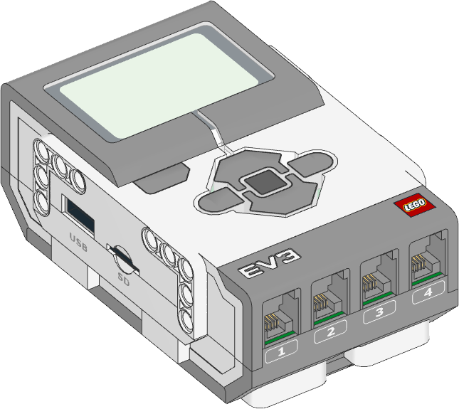

EV3 Brick
^^^^^^^^^^^^^^^^^^^^^^^^^^^^^^^

.. autoclass:: pybricks.hubs.EV3Brick
    :no-members:

    .. rubric:: Using the buttons

    .. automethod:: pybricks.hubs::EV3Brick.buttons.pressed

    .. rubric:: Using the brick status light

    .. automethod:: pybricks.hubs::EV3Brick.light.on

    .. automethod:: pybricks.hubs::EV3Brick.light.off

    .. automethod:: pybricks.hubs::EV3Brick.light.blink

    .. automethod:: pybricks.hubs::EV3Brick.light.animate

    .. rubric:: Using the speaker

    .. automethod:: pybricks.hubs::EV3Brick.speaker.volume

    .. automethod:: pybricks.hubs::EV3Brick.speaker.beep

    .. automethod:: pybricks.hubs::EV3Brick.speaker.play_notes

    .. rubric:: Using the screen

    .. |this image| replace:: the screen

    .. automethod:: pybricks.hubs::EV3Brick.screen.clear

    .. automethod:: pybricks.hubs::EV3Brick.screen.draw_text
        :noindex:

    .. automethod:: pybricks.hubs::EV3Brick.screen.print
        :noindex:

    .. automethod:: pybricks.hubs::EV3Brick.screen.set_font
        :noindex:

    .. automethod:: pybricks.hubs::EV3Brick.screen.load_image

    .. automethod:: pybricks.hubs::EV3Brick.screen.draw_image
        :noindex:

    .. automethod:: pybricks.hubs::EV3Brick.screen.draw_pixel

    .. automethod:: pybricks.hubs::EV3Brick.screen.draw_line

    .. automethod:: pybricks.hubs::EV3Brick.screen.draw_box

    .. automethod:: pybricks.hubs::EV3Brick.screen.draw_circle

    .. autoattribute:: pybricks.hubs::EV3Brick.screen.width
        :annotation: = 178

    .. autoattribute:: pybricks.hubs::EV3Brick.screen.height
        :annotation: = 128

    .. rubric:: Using the battery

    .. automethod:: pybricks.hubs::EV3Brick.battery.voltage

    .. automethod:: pybricks.hubs::EV3Brick.battery.current

Status light examples
---------------------

Turn the light on and change the color
**************************************

.. literalinclude::
    ../../../examples/ev3/light_color/main.py

Screen examples
---------------------

Drawing shapes on the screen
****************************

.. literalinclude::
    ../../../examples/ev3/screen_draw/main.py
