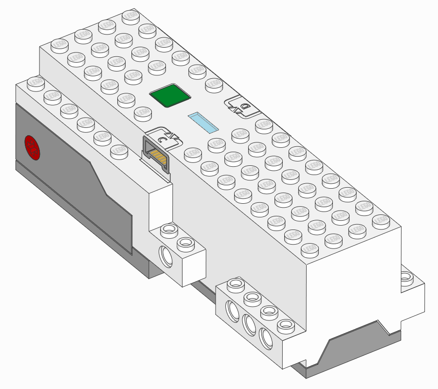
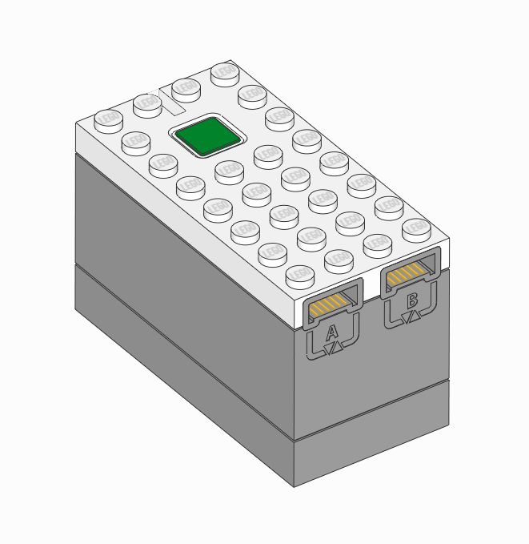
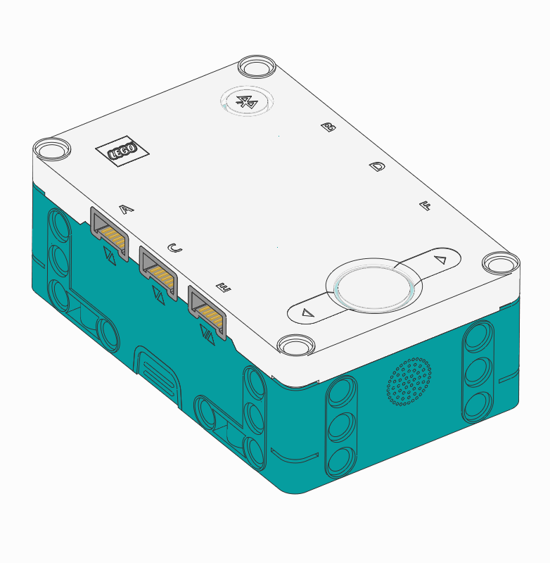

:mod:`hubs <pybricks.hubs>` -- Programmable Hubs
================================================

.. module:: pybricks.hubs

.. toctree::
   :maxdepth: 1
   :hidden:

   movehub
   cityhub
   technichub
   primehub

.. pybricks-classlink:: MoveHub

.. pybricks-classlink:: CityHub

.. pybricks-classlink:: TechnicHub

.. figure:: ../../main/images/technichub.png
    :height: 10 em
    :target: technichub.html

.. pybricks-classlink:: PrimeHub

.. figure:: ../../main/images/primehub.png
    :height: 10 em
    :target: primehub.html

.. pybricks-classlink:: InventorHub

