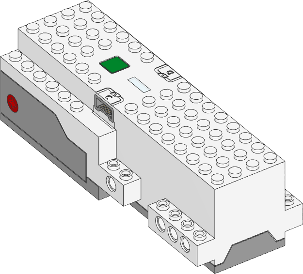
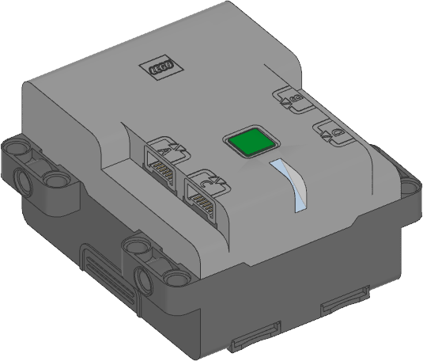
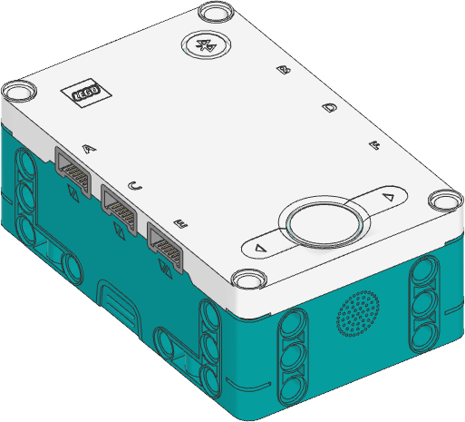
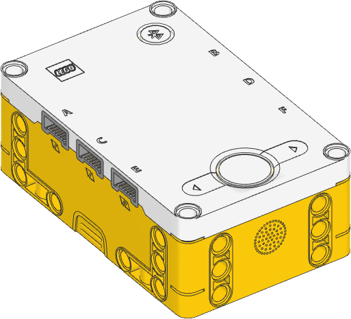
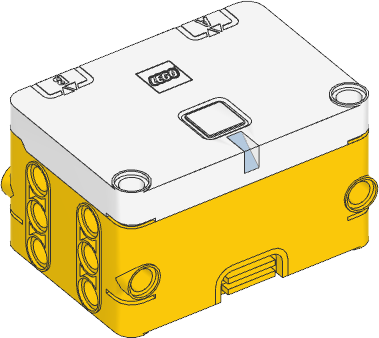

.. pybricks-requirements::

:mod:`hubs <pybricks.hubs>` -- Built-in hub functions
=====================================================

.. module:: pybricks.hubs

.. toctree::
   :maxdepth: 1
   :hidden:

   movehub
   cityhub
   technichub
   primehub
   essentialhub

.. pybricks-classlink:: MoveHub

.. pybricks-classlink:: CityHub

.. figure:: ../../main/cad/output/hub-city.png
    :width: 25%
    :target: cityhub.html

.. pybricks-classlink:: TechnicHub

.. pybricks-classlink:: InventorHub PrimeHub

.. pybricks-classlink:: PrimeHub

.. pybricks-classlink:: EssentialHub

