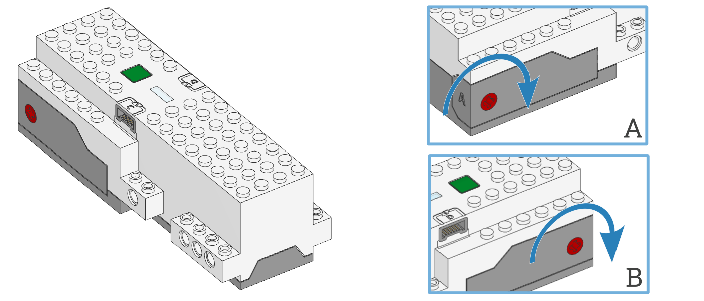

.. pybricks-requirements:: movehub

Move Hub
^^^^^^^^^^^^^^^^^^^^^^^^^^^^^^^

.. _fig_movehub:

.. autoclass:: pybricks.hubs.MoveHub
    :no-members:

    .. rubric:: Using the hub status light

    .. automethod:: pybricks.hubs::MoveHub.light.on

    .. automethod:: pybricks.hubs::MoveHub.light.off

    .. automethod:: pybricks.hubs::MoveHub.light.blink

    .. automethod:: pybricks.hubs::MoveHub.light.animate

    .. rubric:: Using the IMU

    .. automethod:: pybricks.hubs::MoveHub.imu.up

    .. automethod:: pybricks.hubs::MoveHub.imu.acceleration

        .. versionchanged:: 3.2

            Changed acceleration units from m/s² to mm/s².

    .. rubric:: Using the battery

    .. automethod:: pybricks.hubs::MoveHub.battery.voltage

    .. automethod:: pybricks.hubs::MoveHub.battery.current

    .. rubric:: Button and system control

    .. automethod:: pybricks.hubs::MoveHub.button.pressed

    .. automethod:: pybricks.hubs::MoveHub.system.set_stop_button

    .. automethod:: pybricks.hubs::MoveHub.system.name

    .. automethod:: pybricks.hubs::MoveHub.system.storage

    .. automethod:: pybricks.hubs::MoveHub.system.shutdown

    .. automethod:: pybricks.hubs::MoveHub.system.reset_reason

Status light examples
---------------------

Turning the light on and off
******************************

.. literalinclude::
    ../../../examples/pup/hub_common/build/light_off_movehub.py

Making the light blink
******************************

.. literalinclude::
    ../../../examples/pup/hub_common/build/light_blink_movehub.py

IMU examples
---------------

Testing which way is up
********************************

.. literalinclude::
    ../../../examples/pup/hub_common/build/imu_up_movehub.py

Reading acceleration
**************************************************

.. literalinclude::
    ../../../examples/pup/hub_movehub/imu_read_acceleration.py

Button and system examples
----------------------------------

Using the stop button during your program
*****************************************

.. literalinclude::
    ../../../examples/pup/hub_common/build/button_single_movehub.py

Turning the hub off
*****************************************

.. literalinclude::
    ../../../examples/pup/hub_common/build/system_shutdown_movehub.py
