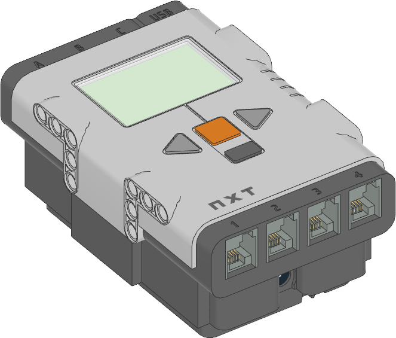

NXT Brick
^^^^^^^^^^^^^^^^^^^^^^^^^^^^^^^

.. autoclass:: pybricks.hubs.NXTBrick
    :no-members:

    .. rubric:: Using the buttons

    .. blockimg:: pybricks_blockButtonIsPressed_NXTBrick

    .. automethod:: pybricks.hubs::NXTBrick.buttons.pressed

    .. rubric:: Using the speaker

    .. automethod:: pybricks.hubs::NXTBrick.speaker.volume

    .. blockimg:: pybricks_blockSpeakerBeep_NXTBrick

    .. automethod:: pybricks.hubs::NXTBrick.speaker.beep

    .. automethod:: pybricks.hubs::NXTBrick.speaker.play_notes

    .. rubric:: Using the screen

    .. |this image| replace:: the screen

    .. automethod:: pybricks.hubs::NXTBrick.screen.clear

    .. automethod:: pybricks.hubs::NXTBrick.screen.draw_text
        :noindex:

    .. automethod:: pybricks.hubs::NXTBrick.screen.print
        :noindex:

    .. automethod:: pybricks.hubs::NXTBrick.screen.set_font
        :noindex:

    .. automethod:: pybricks.hubs::NXTBrick.screen.load_image

    .. automethod:: pybricks.hubs::NXTBrick.screen.draw_image
        :noindex:

    .. automethod:: pybricks.hubs::NXTBrick.screen.draw_pixel

    .. automethod:: pybricks.hubs::NXTBrick.screen.draw_line

    .. automethod:: pybricks.hubs::NXTBrick.screen.draw_box

    .. automethod:: pybricks.hubs::NXTBrick.screen.draw_circle

    .. autoattribute:: pybricks.hubs::NXTBrick.screen.width
        :annotation: = 100

    .. autoattribute:: pybricks.hubs::NXTBrick.screen.height
        :annotation: = 64

    .. rubric:: Using the battery

    .. blockimg:: pybricks_blockBatteryMeasure_NXTBrick_battery.voltage

    .. automethod:: pybricks.hubs::NXTBrick.battery.voltage

    .. blockimg:: pybricks_blockBatteryMeasure_NXTBrick_battery.current

    .. automethod:: pybricks.hubs::NXTBrick.battery.current

    .. rubric:: System control

    .. automethod:: pybricks.hubs::NXTBrick.system.info

    .. blockimg:: pybricks_blockHubStopButton_NXTBrick

    .. blockimg:: pybricks_blockHubStopButton_NXTBrick_none

    .. automethod:: pybricks.hubs::NXTBrick.system.set_stop_button

    .. automethod:: pybricks.hubs::NXTBrick.system.storage

    .. automethod:: pybricks.hubs::NXTBrick.system.reset_storage

    .. blockimg:: pybricks_blockHubShutdown_NXTBrick

    .. automethod:: pybricks.hubs::NXTBrick.system.shutdown
