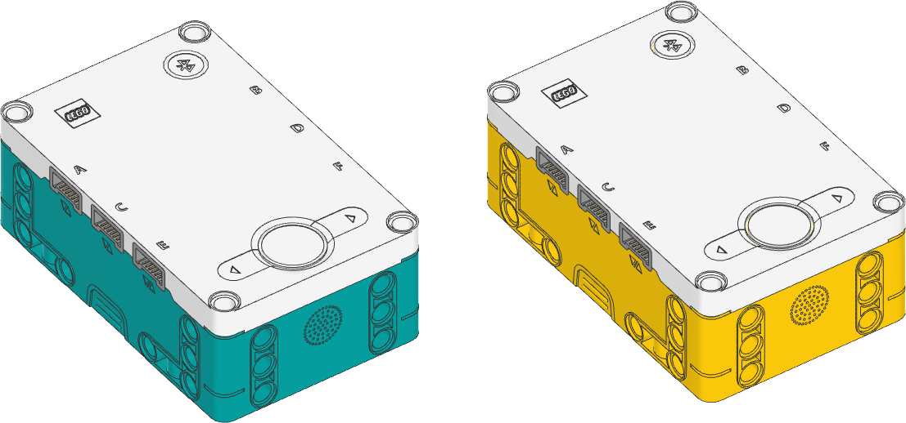

.. pybricks-requirements:: primehub

Prime Hub / Inventor Hub
^^^^^^^^^^^^^^^^^^^^^^^^^^^^^^^^^^^^^^^^^^^^^^^^^^^^^^^^^^^^^^^^^^^^^

.. blockimg:: pybricks_variables_set_inventor_hub_option0

.. blockimg:: pybricks_variables_set_inventor_hub_option4
    :stack:

.. class:: InventorHub

    This class is the same as the ``PrimeHub`` class, shown below. Both classes
    work on both hubs.

    These hubs are completely identical. They use the same Pybricks firmware.

.. blockimg:: pybricks_variables_set_prime_hub_option0

.. blockimg:: pybricks_variables_set_prime_hub_option4
    :stack:

.. autoclass:: pybricks.hubs.PrimeHub
    :no-members:

    .. rubric:: Using the hub status light

    .. figure:: ../../main/diagrams/primehub_light.png
        :width: 22 em

    .. blockimg:: pybricks_blockLightOnColor_primehub_on

    .. automethod:: pybricks.hubs::PrimeHub.light.on

    .. blockimg:: pybricks_blockLightOnColor_primehub_off

    .. automethod:: pybricks.hubs::PrimeHub.light.off

    .. automethod:: pybricks.hubs::PrimeHub.light.blink

    .. automethod:: pybricks.hubs::PrimeHub.light.animate

    .. rubric:: Using the light matrix display

    .. figure:: ../../main/diagrams/primehub_display.png
        :width: 22 em

    .. automethod:: pybricks.hubs::PrimeHub.display.orientation

    .. blockimg:: pybricks_blockLightMatrixDo_light_matrix_off

    .. automethod:: pybricks.hubs::PrimeHub.display.off

    .. blockimg:: pybricks_blockLightMatrixDo_light_matrix_pixel

    .. automethod:: pybricks.hubs::PrimeHub.display.pixel

    .. automethod:: pybricks.hubs::PrimeHub.display.icon

    .. automethod:: pybricks.hubs::PrimeHub.display.animate

    .. blockimg:: pybricks_blockLightMatrixDo_light_matrix_number

    .. automethod:: pybricks.hubs::PrimeHub.display.number

    .. blockimg:: pybricks_blockLightMatrixDo_light_matrix_symbol

    .. automethod:: pybricks.hubs::PrimeHub.display.char

    .. automethod:: pybricks.hubs::PrimeHub.display.text

    .. rubric:: Using the buttons

    .. figure:: ../../main/diagrams/primehub_buttons.png
        :width: 22 em

    .. blockimg:: pybricks_blockButtonIsPressed_PrimeHub

    .. automethod:: pybricks.hubs::PrimeHub.buttons.pressed

    .. automethod:: pybricks.hubs::PrimeHub.system.set_stop_button

    .. rubric:: Using the IMU

    .. automethod:: pybricks.hubs::PrimeHub.imu.ready

    .. automethod:: pybricks.hubs::PrimeHub.imu.stationary

    .. automethod:: pybricks.hubs::PrimeHub.imu.up

    .. blockimg:: pybricks_blockTilt_PrimeHub_imu.tilt.pitch

    .. blockimg:: pybricks_blockTilt_PrimeHub_imu.tilt.roll
        :stack:

    .. automethod:: pybricks.hubs::PrimeHub.imu.tilt

    .. blockimg:: pybricks_blockImuAcceleration_PrimeHub

    .. automethod:: pybricks.hubs::PrimeHub.imu.acceleration

    .. blockimg:: pybricks_blockImuRotation_PrimeHub_imu.angular_velocity

    .. automethod:: pybricks.hubs::PrimeHub.imu.angular_velocity

    .. blockimg:: pybricks_blockImuGetHeading_PrimeHub

    .. automethod:: pybricks.hubs::PrimeHub.imu.heading

    .. blockimg:: pybricks_blockImuResetHeading_PrimeHub

    .. automethod:: pybricks.hubs::PrimeHub.imu.reset_heading

    .. blockimg:: pybricks_blockImuRotation_PrimeHub_imu.rotation

    .. automethod:: pybricks.hubs::PrimeHub.imu.rotation

    .. automethod:: pybricks.hubs::PrimeHub.imu.orientation

    .. automethod:: pybricks.hubs::PrimeHub.imu.settings

    .. rubric:: Using the speaker

    .. automethod:: pybricks.hubs::PrimeHub.speaker.volume

    .. automethod:: pybricks.hubs::PrimeHub.speaker.beep

    .. automethod:: pybricks.hubs::PrimeHub.speaker.play_notes

    .. rubric:: Using connectionless Bluetooth messaging

    .. blockimg:: pybricks_blockBleBroadcast_PrimeHub

    .. automethod:: pybricks.hubs::PrimeHub.ble.broadcast

    .. blockimg:: pybricks_blockBleObserve_PrimeHub

    .. automethod:: pybricks.hubs::PrimeHub.ble.observe

    .. automethod:: pybricks.hubs::PrimeHub.ble.signal_strength

    .. automethod:: pybricks.hubs::PrimeHub.ble.version

    .. rubric:: Using the battery

    .. blockimg:: pybricks_blockBatteryMeasure_PrimeHub_battery.voltage

    .. automethod:: pybricks.hubs::PrimeHub.battery.voltage

    .. blockimg:: pybricks_blockBatteryMeasure_PrimeHub_battery.current

    .. automethod:: pybricks.hubs::PrimeHub.battery.current

    .. rubric:: Getting the charger status

    .. automethod:: pybricks.hubs::PrimeHub.charger.connected

    .. automethod:: pybricks.hubs::PrimeHub.charger.current

    .. automethod:: pybricks.hubs::PrimeHub.charger.status

    .. rubric:: System control

    .. automethod:: pybricks.hubs::PrimeHub.system.name

    .. automethod:: pybricks.hubs::PrimeHub.system.storage

        You can store up to 512 bytes of data on this hub.

    .. automethod:: pybricks.hubs::PrimeHub.system.shutdown

    .. automethod:: pybricks.hubs::PrimeHub.system.reset_reason

.. note:: The examples below use the ``PrimeHub`` class. The examples work fine
        on both hubs because they are the identical. If you prefer, you can
        change this to ``InventorHub``.

Status light examples
---------------------

Turning the light on and off
****************************

.. literalinclude::
    ../../../examples/pup/hub_common/build/light_off_primehub.py

Changing brightness and using custom colors
*******************************************

.. literalinclude::
    ../../../examples/pup/hub_common/build/light_hsv_primehub.py

Making the light blink
**********************

.. literalinclude::
    ../../../examples/pup/hub_common/build/light_blink_primehub.py

Creating light animations
*************************

.. literalinclude::
    ../../../examples/pup/hub_common/build/light_animate_primehub.py

Matrix display examples
-----------------------

Displaying images
*****************

.. literalinclude::
    ../../../examples/pup/hub_primehub/display_image.py

Displaying numbers
******************

.. literalinclude::
    ../../../examples/pup/hub_primehub/display_number.py

Displaying text
***************

.. literalinclude::
    ../../../examples/pup/hub_primehub/display_text.py

Displaying individual pixels
****************************

.. literalinclude::
    ../../../examples/pup/hub_primehub/display_pixel.py

Changing the display orientation
********************************

.. literalinclude::
    ../../../examples/pup/hub_primehub/display_orientation.py

.. literalinclude::
    ../../../examples/pup/hub_primehub/display_orientation_imu.py

.. _make_icons:

Making your own images
**********************

.. literalinclude::
    ../../../examples/pup/hub_primehub/display_matrix.py

Combining icons to make expressions
************************************

.. literalinclude::
    ../../../examples/pup/hub_primehub/display_expression.py

Displaying animations
*********************

.. literalinclude::
    ../../../examples/pup/hub_primehub/display_animate.py

Button examples
---------------

Detecting button presses
************************

.. literalinclude::
    ../../../examples/pup/hub_primehub/button_main.py

IMU examples
---------------

Testing which way is up
********************************

.. literalinclude::
    ../../../examples/pup/hub_common/build/imu_up_primehub.py

Reading the tilt value
********************************

.. literalinclude::
    ../../../examples/pup/hub_common/build/imu_tilt_primehub.py

Using a custom hub orientation
**************************************************

.. literalinclude::
    ../../../examples/pup/hub_common/build/imu_tilt_blast_primehub.py

Reading acceleration and angular velocity vectors
**************************************************

.. literalinclude::
    ../../../examples/pup/hub_common/build/imu_read_vector_primehub.py

Reading acceleration and angular velocity on one axis
*****************************************************

.. literalinclude::
    ../../../examples/pup/hub_common/build/imu_read_scalar_primehub.py

Bluetooth examples
------------------

Broadcasting data to other hubs
*******************************

.. literalinclude::
    ../../../examples/pup/hub_common/build/ble_broadcast_primehub.py

Observing data from other hubs
******************************

.. literalinclude::
    ../../../examples/pup/hub_common/build/ble_observe_primehub.py

System examples
----------------------------------

Changing the stop button combination
*****************************************

.. literalinclude::
    ../../../examples/pup/hub_primehub/button_stop.py

Turning the hub off
*****************************************

.. literalinclude::
    ../../../examples/pup/hub_common/build/system_shutdown_primehub.py

