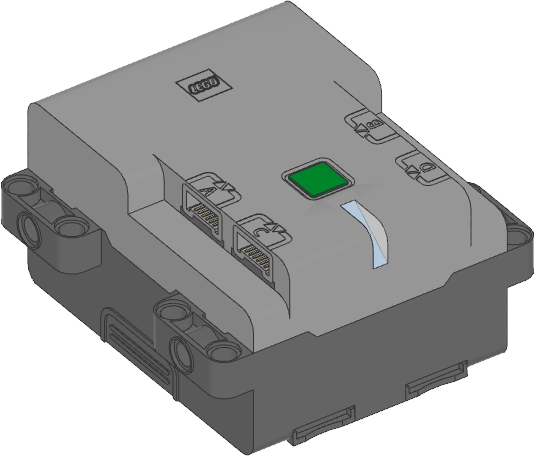

.. pybricks-requirements:: technichub

Technic Hub
^^^^^^^^^^^^^^^^^^^^^^^^^^^^^^^

.. autoclass:: pybricks.hubs.TechnicHub
    :no-members:

    .. rubric:: Using the hub status light

    .. automethod:: pybricks.hubs::TechnicHub.light.on

    .. automethod:: pybricks.hubs::TechnicHub.light.off

    .. automethod:: pybricks.hubs::TechnicHub.light.blink

    .. automethod:: pybricks.hubs::TechnicHub.light.animate

    .. rubric:: Using the IMU

    .. automethod:: pybricks.hubs::TechnicHub.imu.up

    .. automethod:: pybricks.hubs::TechnicHub.imu.tilt

    .. automethod:: pybricks.hubs::TechnicHub.imu.acceleration

    .. automethod:: pybricks.hubs::TechnicHub.imu.angular_velocity

    .. automethod:: pybricks.hubs::TechnicHub.imu.heading

    .. automethod:: pybricks.hubs::TechnicHub.imu.reset_heading

    .. automethod:: pybricks.hubs::TechnicHub.imu.rotation

    .. automethod:: pybricks.hubs::TechnicHub.imu.orientation

    .. rubric:: Using the battery

    .. automethod:: pybricks.hubs::TechnicHub.battery.voltage

    .. automethod:: pybricks.hubs::TechnicHub.battery.current

    .. rubric:: Button and system control

    .. automethod:: pybricks.hubs::TechnicHub.button.pressed

    .. automethod:: pybricks.hubs::TechnicHub.system.set_stop_button

    .. automethod:: pybricks.hubs::TechnicHub.system.name

    .. automethod:: pybricks.hubs::TechnicHub.system.storage

        You can store up to 128 bytes of data on this hub. The data is cleared
        when you update the Pybricks firmware or if you restore the original
        firmware.

    .. automethod:: pybricks.hubs::TechnicHub.system.shutdown

    .. automethod:: pybricks.hubs::TechnicHub.system.reset_reason

Status light examples
---------------------

Turning the light on and off
****************************

.. literalinclude::
    ../../../examples/pup/hub_common/build/light_off_technichub.py

Changing brightness and using custom colors
*******************************************

.. literalinclude::
    ../../../examples/pup/hub_common/build/light_hsv_technichub.py

Making the light blink
**********************

.. literalinclude::
    ../../../examples/pup/hub_common/build/light_blink_technichub.py

Creating light animations
*************************

.. literalinclude::
    ../../../examples/pup/hub_common/build/light_animate_technichub.py

IMU examples
---------------

Testing which way is up
********************************

.. literalinclude::
    ../../../examples/pup/hub_common/build/imu_up_technichub.py

Reading the tilt value
********************************

.. literalinclude::
    ../../../examples/pup/hub_common/build/imu_tilt_technichub.py

Using a custom hub orientation
**************************************************

.. literalinclude::
    ../../../examples/pup/hub_common/build/imu_tilt_blast_technichub.py

Reading acceleration and angular velocity vectors
**************************************************

.. literalinclude::
    ../../../examples/pup/hub_common/build/imu_read_vector_technichub.py

Reading acceleration and angular velocity on one axis
*****************************************************

.. literalinclude::
    ../../../examples/pup/hub_common/build/imu_read_scalar_technichub.py

Button and system examples
----------------------------------

Using the stop button during your program
*****************************************

.. literalinclude::
    ../../../examples/pup/hub_common/build/button_single_technichub.py

Turning the hub off
*****************************************

.. literalinclude::
    ../../../examples/pup/hub_common/build/system_shutdown_technichub.py
