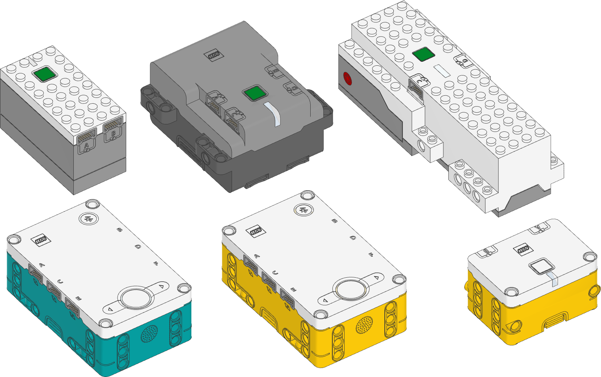
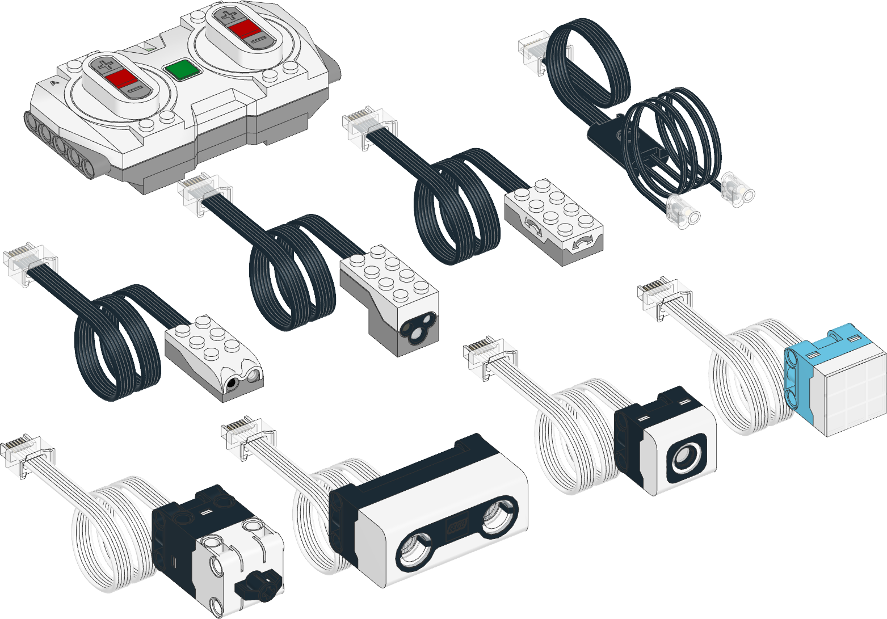

Pybricks Documentation
==================================================================

`Pybricks <https://pybricks.com/>`_ is Python coding for smart LEGO® hubs.
Run MicroPython scripts
directly on the hub, and get full control of your motors and sensors.

Pybricks runs on LEGO® BOOST, City, Technic, MINDSTORMS®, and SPIKE®. You
can code using Windows, Mac, Linux, Chromebook, and Android.

Click on any device below to see its documentation. Use the menu on the left
to find documentation for additional modules. You may need to click the ☰ icon
above to reveal this menu.

.. only:: main

   .. note:: You are viewing the stand-alone version of the documentation. To
             learn more about Pybricks and to start coding, visit
             the `Pybricks website`_

   .. note:: Are you using LEGO MINDSTORMS EV3? Check out the
            `EV3 documentation`_ instead.

.. _EV3 documentation: https://pybricks.com/ev3-micropython/
.. _Pybricks website: https://pybricks.com/

.. rubric:: Programmable hubs

.. rubric:: Powered Up motors and sensors

.. figure:: ../main/cad/output/pupdevice-motors.png
   :width: 100 %
   :target: pupdevices/motor.html

.. figure:: ../main/cad/output/pupdevice-dcmotors.png
   :width: 70 %
   :target: pupdevices/dcmotor.html

.. toctree::
    :maxdepth: 1
    :caption: Table of contents
    :hidden:

.. toctree::
   :maxdepth: 1
   :caption: Pybricks modules
   :hidden:

   hubs/index
   pupdevices/index
   iodevices/index
   parameters/index
   tools/index
   robotics
   signaltypes

.. toctree::
   :maxdepth: 1
   :caption: Code with blocks
   :hidden:

   blocks/index

.. toctree::
   :maxdepth: 1
   :caption: MicroPython modules
   :hidden:

   micropython/builtins
   micropython/exceptions
   micropython/micropython
   micropython/uerrno
   micropython/uio
   micropython/ujson
   micropython/umath
   micropython/urandom
   micropython/uselect
   micropython/ustruct
   micropython/usys
