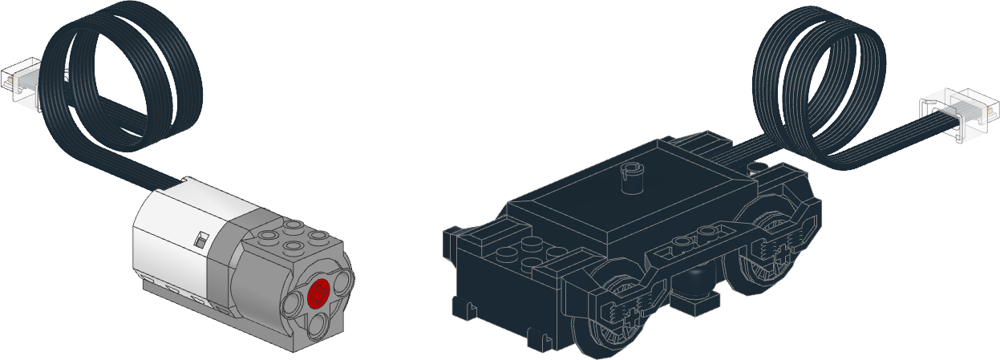

Pybricks Documentation
==================================================================

`Pybricks <https://pybricks.com/>`_ is Python coding for smart LEGO® hubs.
Run MicroPython scripts
directly on the hub, and get full control of your motors and sensors.

Pybricks runs on LEGO® BOOST, City, Technic, MINDSTORMS®, and SPIKE®. You
can code using Windows, Mac, Linux, Chromebook, and Android.

To run Pybricks MicroPython scripts, you must install the Pybricks firmware
on your hub. Check `pybricks.com/install`_ to learn how.

.. only:: main

   .. note:: Are you using LEGO MINDSTORMS EV3? Check out the
            `EV3 documentation`_ instead.

.. rubric:: Programmable hubs

.. figure:: ../main/cad/output/hub-all.png
   :width: 100 %
   :target: hubs/index.html

.. rubric:: Powered Up motors and sensors

.. figure:: ../main/cad/output/pupdevice-motors.png
   :width: 100 %
   :target: pupdevices/motor.html

.. _support page: https://github.com/pybricks/support/issues/
.. _EV3 documentation: https://pybricks.com/ev3-micropython/
.. _Pybricks website: https://pybricks.com/
.. _pybricks.com/install: https://pybricks.com/install/
.. _latest stable release: https://www.code.pybricks.com/

.. toctree::
    :maxdepth: 1
    :caption: Table of contents
    :hidden:

.. toctree::
    :maxdepth: 1
    :caption: Pybricks
    :hidden:

    Home page <https://pybricks.com>
    Installation <https://pybricks.com/install/>

.. toctree::
   :maxdepth: 1
   :caption: Pybricks modules
   :hidden:

   hubs/index
   pupdevices/index
   iodevices/index
   parameters/index
   tools/index
   robotics
   geometry
   signaltypes

.. toctree::
   :maxdepth: 1
   :caption: MicroPython modules
   :hidden:

   micropython/builtins
   micropython/exceptions
   micropython/micropython
   micropython/uerrno
   micropython/uio
   micropython/ujson
   micropython/umath
   micropython/urandom
   micropython/uselect
   micropython/ustruct
   micropython/usys
