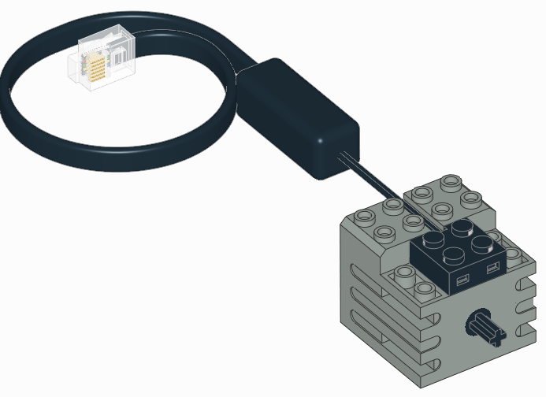

EV3 DC Motor
^^^^^^^^^^^^^^^^^^

.. note::

   This class is specifically for on EV3. For Powered Up DC Motors, just use
   the :class:`DCMotor <pybricks.pupdevices.DCMotor>` class.

.. autoclass:: pybricks._common.DCMotor
    :noindex:
    :no-members:

    .. automethod:: pybricks._common.DCMotor.dc
        :noindex:

    .. automethod:: pybricks._common.DCMotor.stop
        :noindex:
