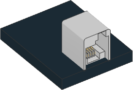

Ev3dev sensors
^^^^^^^^^^^^^^^^^^

.. note::

   This class is only available on EV3.

EV3 MicroPython is built on top of ev3dev, which means that a sensor
may be supported even if it is not listed in this documentation. If so, you can
use it with the ``Ev3devSensor`` class. This is easier and faster than using
the custom device classes given above.

To check whether you can use the ``Ev3devSensor`` class:

    * Plug the sensor into your EV3 Brick.
    * Go to the main menu of the EV3 Brick.
    * Select `Device Browser` and then `Sensors`.
    * If your sensor shows up, you can use it.

Now select your sensor from the menu and choose `set mode`. This shows all
available modes for this sensor. You can use these mode names as the ``mode``
setting below.

To learn more about compatible devices and what each mode does,
visit the `ev3dev sensors`_ page.

.. autoclass:: pybricks.iodevices.Ev3devSensor
    :no-members:

    .. autoattribute:: pybricks.iodevices.Ev3devSensor.sensor_index
        :annotation:

    .. autoattribute:: pybricks.iodevices.Ev3devSensor.port_index
        :annotation:

    .. automethod:: pybricks.iodevices.Ev3devSensor.read

**Example: Reading values with the Ev3devSensor class**

In this example we use the LEGO MINDSTORMS EV3 Color Sensor with the raw
RGB mode. This gives uncalibrated red, green, and blue reflection values.

.. literalinclude::
   ../../../examples/ev3/ev3devsensor/main.py

**Example: Extending the Ev3devSensor class**

This example shows how to extend the ``Ev3devSensor`` class by accessing
additional features found in the Linux system folder for this device.

.. literalinclude::
   ../../../examples/ev3/ev3devsensor/class_example.py

.. _ev3dev sensors: http://docs.ev3dev.org/projects/lego-linux-drivers/en/ev3dev-stretch/sensors.html
.. _Mode name: http://docs.ev3dev.org/projects/lego-linux-drivers/en/ev3dev-stretch/sensor_data.html
.. _lego-sensor: http://docs.ev3dev.org/projects/lego-linux-drivers/en/ev3dev-stretch/sensors.html#the-lego-sensor-subsytem
.. _lego-port: http://docs.ev3dev.org/projects/lego-linux-drivers/en/ev3dev-stretch/ports.html#the-lego-port-subsystem
