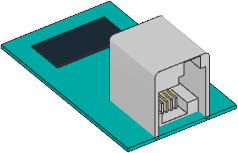

Generic I2C Device
^^^^^^^^^^^^^^^^^^

.. note::

   This class is **only supported on the EV3** at this time. It could be added
   to Powered Up hubs in a future release. If you'd like to see this happen, be
   sure to ask us on our `support page`_.

.. _support page: https://github.com/pybricks/support/issues/

.. autoclass:: pybricks.iodevices.I2CDevice

**Example: Read and write to an I2C device**

.. literalinclude:: ../../../examples/ev3/i2c_basics/main.py

.. _i2caddress:

I2C Addresses
---------------
I2C addresses are 7-bit values. However, most vendors who make LEGO compatible
sensors provide an 8-bit address in their documentation.
To use those addresses, you must shift them by 1 bit.
For example, if the documented address is ``0xD2``, you can do
``address = 0xD2 >> 1``.

Advanced I2C Commands
---------------------
Some rudimentary I2C devices do not require a register argument or even any
data. You can achieve this behavior as shown in the examples below.

**Example: Advanced I2C read and write techniques**

.. literalinclude:: ../../../examples/ev3/i2c_extra/main.py

**Additional technical resources**

The ``I2CDevice`` class methods call functions from the Linux SMBus driver.
To find out which commands are called under the hood, check the
`Pybricks source code`_.
More details about using I2C without MicroPython can be found on
the `ev3dev I2C`_ page.

.. _ev3dev I2C: http://docs.ev3dev.org/projects/lego-linux-drivers/en/ev3dev-stretch/i2c.html
.. _Pybricks source code: https://github.com/pybricks/pybricks-micropython
