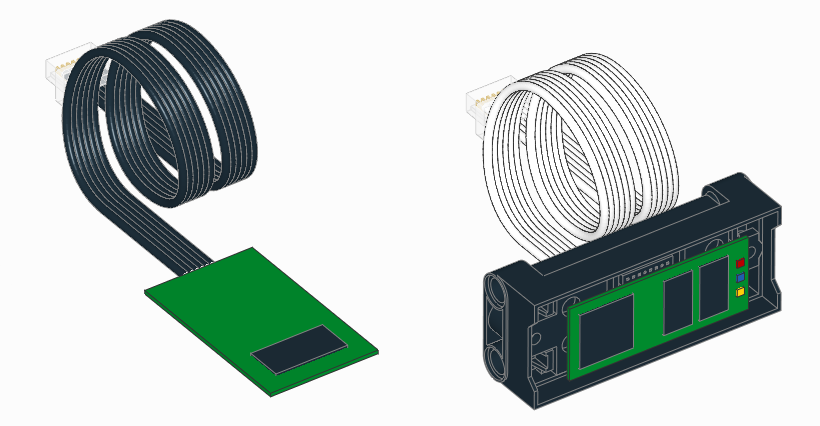

.. pybricks-requirements:: pybricks-iodevices

:mod:`iodevices <pybricks.iodevices>` -- Generic I/O Devices
============================================================

.. module:: pybricks.iodevices

.. toctree::
   :maxdepth: 1
   :hidden:

   pupdevice

This module has classes for generic input/output devices.

.. pybricks-classlink:: PUPDevice

