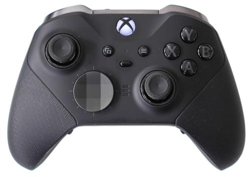
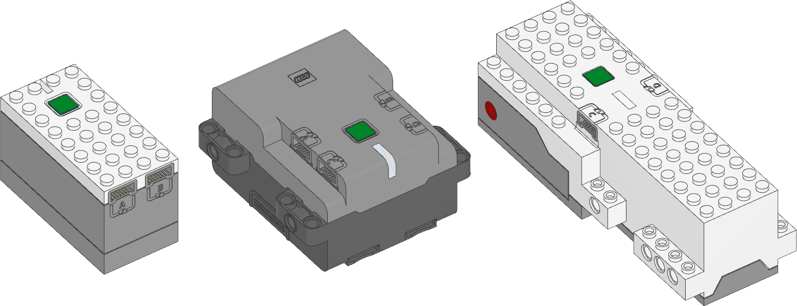
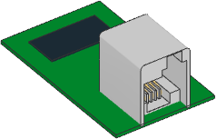
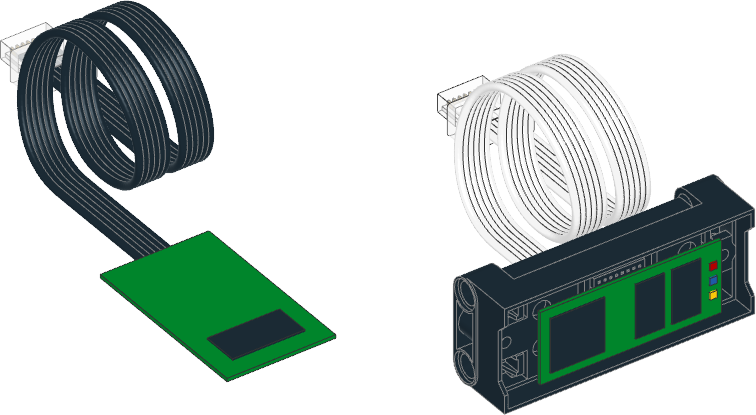
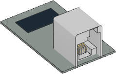
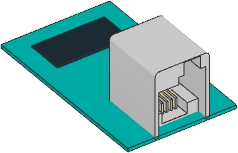
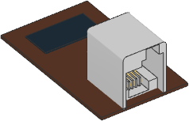
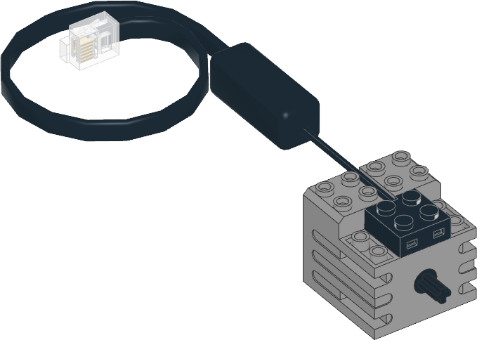

:mod:`iodevices <pybricks.iodevices>` -- Custom devices
============================================================

.. module:: pybricks.iodevices

This module has classes for generic and custom input/output devices.

Wireless devices
----------------

.. toctree::
   :maxdepth: 1
   :hidden:

   xboxcontroller

.. pybricks-requirements:: pybricks-iodevices

.. pybricks-classlink:: XboxController

LEGO protocol devices
---------------------

.. toctree::
   :maxdepth: 1
   :hidden:

   lwp3device
   lumpdevice
   pupdevice

.. pybricks-requirements:: pybricks-iodevices

.. pybricks-classlink:: LWP3Device

.. pybricks-requirements:: pybricks-iodevices

.. pybricks-classlink:: LUMPDevice

.. pybricks-requirements:: pybricks-iodevices

.. pybricks-classlink:: PUPDevice

Generic protocols
-----------------

.. toctree::
   :maxdepth: 1
   :hidden:

   uartdevice
   i2cdevice
   analogsensor
   dcmotor

.. pybricks-requirements:: pybricks-iodevices

.. pybricks-classlink:: UARTDevice

|uart-wired| |uart-wireless|

.. pybricks-requirements:: pybricks-iodevices

.. pybricks-classlink:: I2CDevice

.. pybricks-requirements:: pybricks-iodevices

.. pybricks-classlink:: AnalogSensor

.. pybricks-requirements:: pybricks-iodevices

.. pybricks-classlink:: DCMotor

