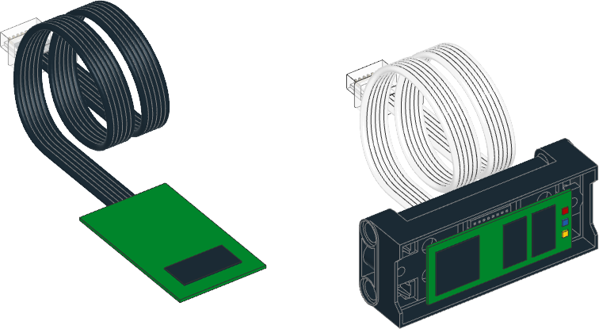

.. pybricks-requirements:: pybricks-iodevices

:mod:`iodevices <pybricks.iodevices>` -- Custom devices
============================================================

.. module:: pybricks.iodevices

.. toctree::
   :maxdepth: 1
   :hidden:

   pupdevice
   lwp3device
   xboxcontroller

This module has classes for generic and custom input/output devices.

.. pybricks-classlink:: PUPDevice

.. pybricks-classlink:: LWP3Device

.. figure:: ../../main/cad/output/hub-lwp3.png
   :width: 80 %
   :target: lwp3device.html

.. pybricks-classlink:: XboxController

.. figure:: ../../main/diagrams_source/xboxcontroller.png
   :width: 40 %
   :target: xboxcontroller.html
