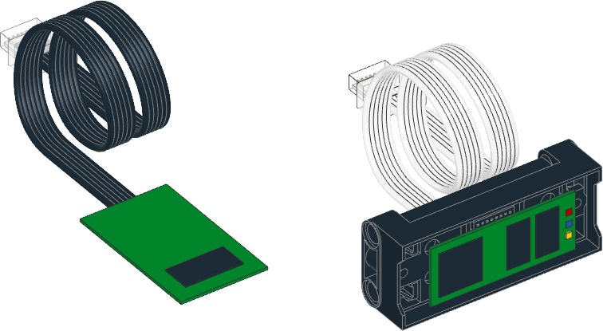

.. pybricks-requirements:: pybricks-iodevices

Powered Up Device
^^^^^^^^^^^^^^^^^

.. autoclass:: pybricks.iodevices.PUPDevice
    :no-members:

    .. automethod:: pybricks.iodevices.PUPDevice.info

    .. automethod:: pybricks.iodevices.PUPDevice.read

    .. automethod:: pybricks.iodevices.PUPDevice.write

Examples
-------------------

Detecting devices
******************************

.. literalinclude::
    ../../../examples/pup/iodevices_pupdevice/port_info.py
