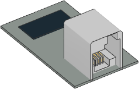

Generic UART Device
^^^^^^^^^^^^^^^^^^^

.. note::

   This class is **only supported on the EV3** at this time. It could be added
   to Powered Up hubs in a future release. If you'd like to see this happen,
   be sure to ask us on our `support page`_.

.. _support page: https://github.com/pybricks/support/issues/

.. autoclass:: pybricks.iodevices.UARTDevice

**Example: Read and write to a UART device**

.. literalinclude::
   ../../../examples/ev3/uart_basics/main.py
