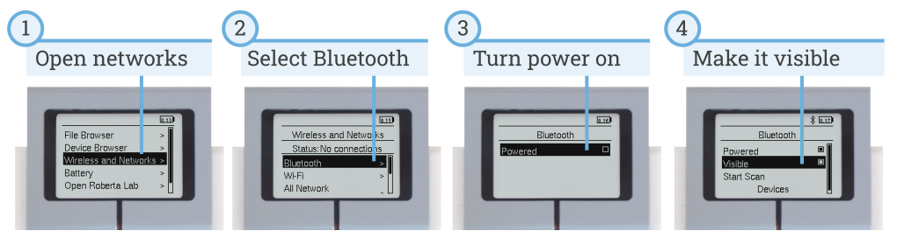
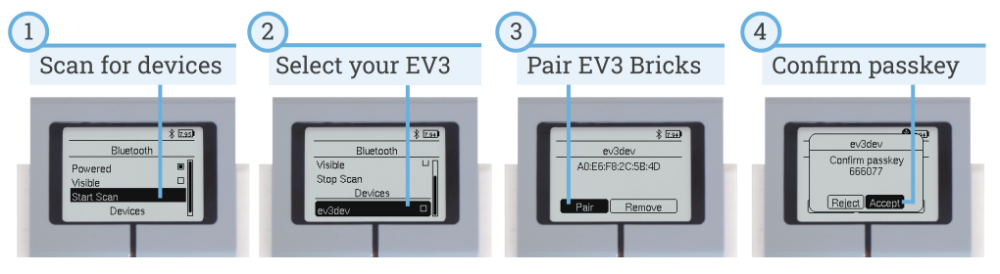
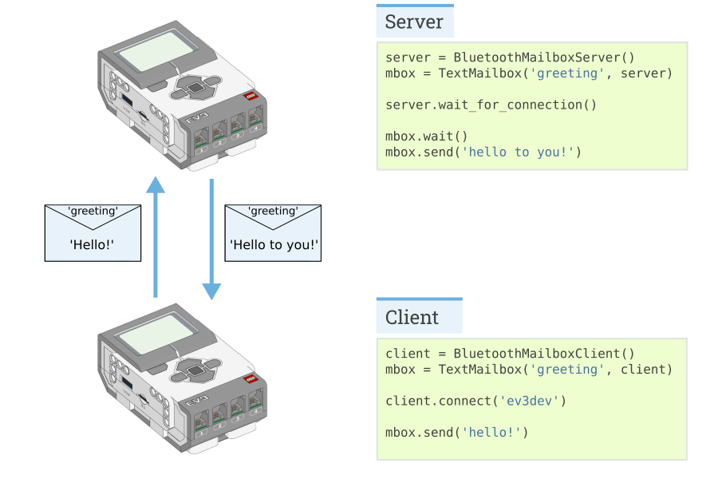
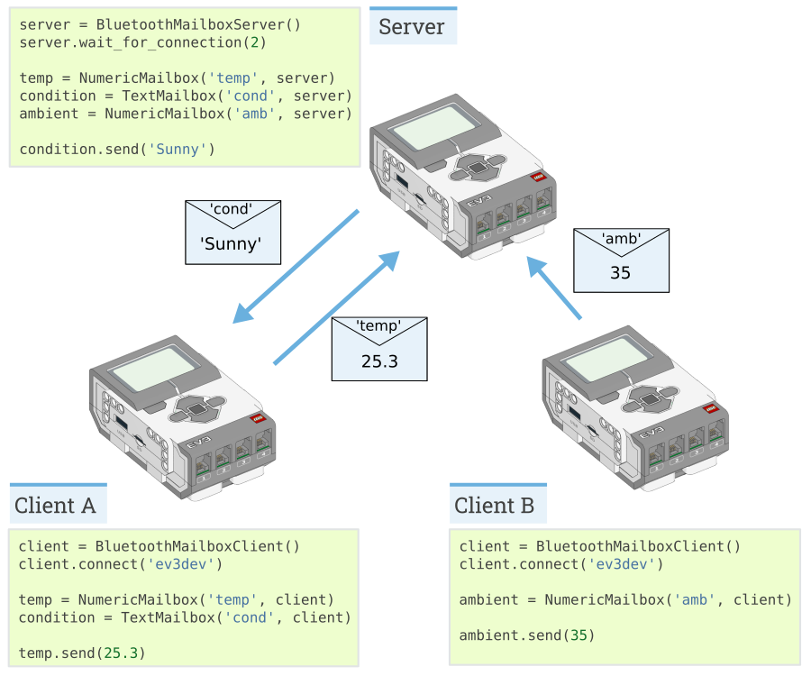

:mod:`messaging <pybricks.messaging>` -- Messaging
==================================================

.. module:: pybricks.messaging

.. currentmodule:: pybricks.messaging

An EV3 Brick can send information to another EV3 Brick using Bluetooth. This
page shows you how to connect multiple bricks and how to write scripts to send
messages between them.

Pairing two EV3 Bricks
----------------------

Before two EV3 bricks can exchange messages, they must be *paired*.
You'll need to do this only the first time. First, activate bluetooth on all
EV3 bricks as shown in :numref:`fig_bluetooth_on`.

.. _fig_bluetooth_on:

   Turn on Bluetooth and make Bluetooth visible.

Now you can make one EV3 Brick search for the other and pair with it, as shown
in :numref:`fig_bluetooth_pair`.

Once they are paired, do *not* click *connect* in the menu that appears.
The connection will be made when you run your programs, as described below.

.. _fig_bluetooth_pair:

   Pairing one EV3 Brick to another EV3 Brick.

When you scan for Bluetooth devices, you'll see a list of device names. By
default, all EV3 Bricks are named *ev3dev*. Click `here`_ to
learn how to change that name. This makes it easy to tell them apart.

Repeat the steps in :numref:`fig_bluetooth_pair` if you want to pair more than
two EV3 Bricks.

Server and Client
-----------------

A wireless network consists of EV3 Bricks acting as servers or clients. A
example with one server and one client is shown in :numref:`fig_messaging`.
Messages can be sent in both ways: the server can send a message to the client,
and the client can send a message to the server.

.. _fig_messaging:

   An example network with one server and one clients.

The only difference between the client and the server is which one initiates
the connection at the beginning of the program:

    - The **server** must always be started first. It uses the
      ``BluetoothMailboxServer`` class. Then it waits for clients using
      the ``wait_for_connection`` method.
    - The **client** uses the ``BluetoothMailboxClient`` class. It
      connects to the server using the ``connect`` method.
    - After that, sending and receiving messages is done in the same way on
      both EV3 Bricks.

.. autoclass:: BluetoothMailboxServer

.. autoclass:: BluetoothMailboxClient

Mailboxes
---------

Mailboxes are used to send data to and from other EV3 Bricks.

A Mailbox has a ``name``, similar to the "subject" of an email. If two EV3
Bricks have a Mailbox with the same name, they can send messages between them.
Each EV3 Brick can read its own Mailbox, and send messages to the Mailbox on
the other EV3 Brick.

Depending on the type of messages you would like to exchange (bytes, booleans,
numbers, or text), you can choose one of the Mailboxes below.

.. autoclass:: Mailbox

.. autoclass:: LogicMailbox
    :no-members:

.. autoclass:: NumericMailbox
    :no-members:

.. autoclass:: TextMailbox
    :no-members:

Examples
-----------------

**EV3 Bluetooth server**

This is the full version of the excerpt shown in :numref:`fig_messaging`.

.. literalinclude:: ../../examples/ev3/bluetooth_server/server.py

**EV3 Bluetooth client**

This is the full version of the excerpt shown in :numref:`fig_messaging`.

.. literalinclude:: ../../examples/ev3/bluetooth_client/client.py

Making bigger networks
----------------------

The classes in this module are not limited to just two EV3 Bricks. for
example, you can add more clients to your network. An example with pseudo-code
is shown in :numref:`fig_messaging_network`.

.. _fig_messaging_network:

   An example network with one server and two clients.

.. _here: https://pybricks.com/install/mindstorms-ev3/beyond-micropython
