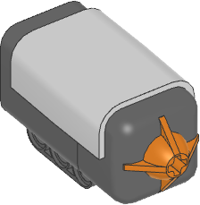
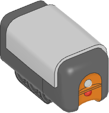
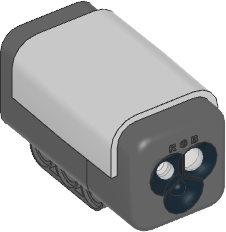
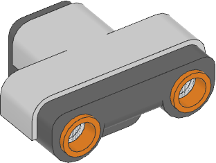
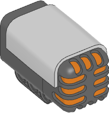
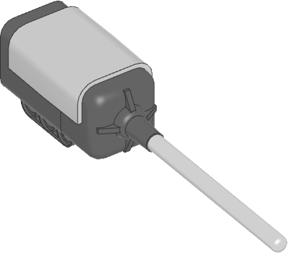
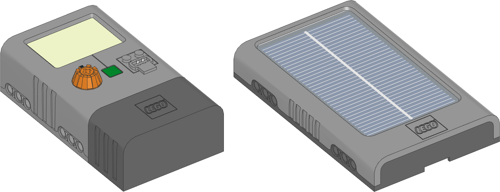

:mod:`nxtdevices <pybricks.nxtdevices>` -- NXT devices
======================================================

.. automodule:: pybricks.nxtdevices
    :no-members:

NXT Motor
^^^^^^^^^^^^^^^^
This motor works just like a LEGO MINDSTORMS EV3 Large Motor. You can use it in
your programs using the :mod:`Motor <.ev3devices>` class.

NXT Touch Sensor
^^^^^^^^^^^^^^^^

.. autoclass:: pybricks.nxtdevices.TouchSensor
    :no-members:

    .. automethod:: pybricks.nxtdevices.TouchSensor.pressed

NXT Light Sensor
^^^^^^^^^^^^^^^^

.. autoclass:: pybricks.nxtdevices.LightSensor

NXT Color Sensor
^^^^^^^^^^^^^^^^

.. autoclass:: pybricks.nxtdevices.ColorSensor
    :no-members:

    .. automethod:: pybricks.nxtdevices.ColorSensor.color

    .. automethod:: pybricks.nxtdevices.ColorSensor.ambient

    .. automethod:: pybricks.nxtdevices.ColorSensor.reflection

    .. automethod:: pybricks.nxtdevices.ColorSensor.rgb

    .. rubric:: Advanced color sensing

    .. automethod:: pybricks.nxtdevices.ColorSensor.hsv

    .. automethod:: pybricks.nxtdevices.ColorSensor.detectable_colors

    .. rubric:: Built-in light

    This sensor has a built-in light. You can make it red, green, blue, or turn
    it off.

    .. automethod:: pybricks.nxtdevices::ColorSensor.light.on

    .. automethod:: pybricks.nxtdevices::ColorSensor.light.off

NXT Ultrasonic Sensor
^^^^^^^^^^^^^^^^^^^^^

.. autoclass:: pybricks.nxtdevices.UltrasonicSensor

NXT Sound Sensor
^^^^^^^^^^^^^^^^^^^^^

.. autoclass:: pybricks.nxtdevices.SoundSensor

NXT Temperature Sensor
^^^^^^^^^^^^^^^^^^^^^^

.. autoclass:: pybricks.nxtdevices.TemperatureSensor

NXT Energy Meter
^^^^^^^^^^^^^^^^^

.. autoclass:: pybricks.nxtdevices.EnergyMeter

Vernier Adapter
^^^^^^^^^^^^^^^^^
.. autoclass:: pybricks.nxtdevices.VernierAdapter

**Example: Using the Surface Temperature Sensor.**

.. literalinclude:: ../../examples/ev3/vernier_surface_temperature/main.py
