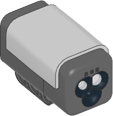

.. pybricks-requirements:: nxtdevices

NXT Color Sensor
^^^^^^^^^^^^^^^^

.. blockimg:: pybricks_variables_set_nxt_color_sensor_nxtcolorsensor_default

.. blockimg:: pybricks_variables_set_nxt_color_sensor_nxtcolorsensor_detectable_colors

.. autoclass:: pybricks.nxtdevices.ColorSensor
    :no-members:

    .. blockimg:: pybricks_blockColor_NXTColorSensor_color

    .. automethod:: pybricks.nxtdevices.ColorSensor.color

    .. blockimg:: pybricks_blockLightAmbient_NXTColorSensor

    .. automethod:: pybricks.nxtdevices.ColorSensor.ambient

    .. blockimg:: pybricks_blockLightReflection_NXTColorSensor

    .. automethod:: pybricks.nxtdevices.ColorSensor.reflection

    .. automethod:: pybricks.nxtdevices.ColorSensor.rgb

    .. rubric:: Advanced color sensing

    .. blockimg:: pybricks_blockColor_NXTColorSensor_hsv

    .. automethod:: pybricks.nxtdevices.ColorSensor.hsv

    .. automethod:: pybricks.nxtdevices.ColorSensor.detectable_colors

    .. rubric:: Built-in light

    This sensor has a built-in light. You can make it red, green, blue, or turn
    it off.

    .. automethod:: pybricks.nxtdevices::ColorSensor.light.on

    .. automethod:: pybricks.nxtdevices::ColorSensor.light.off
