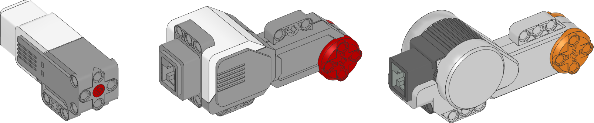
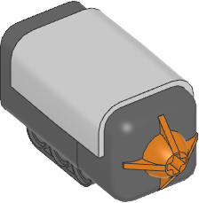
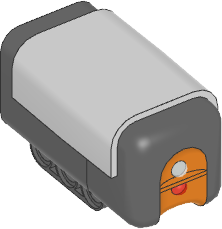
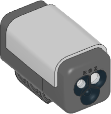
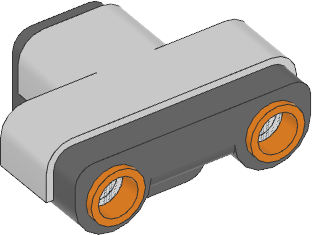
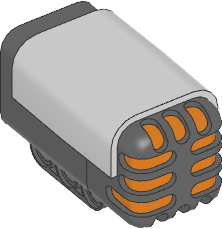
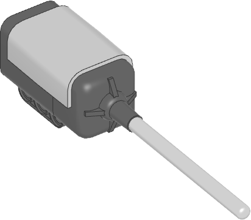

.. pybricks-requirements:: ev3

:mod:`nxtdevices <pybricks.nxtdevices>` -- NXT motors and sensors
=================================================================

.. automodule:: pybricks.nxtdevices
    :no-members:

.. toctree::
   :maxdepth: 1
   :hidden:

   motor
   touchsensor
   lightsensor
   colorsensor
   ultrasonicsensor
   soundsensor
   temperaturesensor
   energymeter
   vernieradapter

.. pybricks-classlink:: Motor ../pupdevices/motor

.. pybricks-classlink:: TouchSensor

.. pybricks-classlink:: LightSensor

.. pybricks-classlink:: ColorSensor

.. pybricks-classlink:: UltrasonicSensor

.. pybricks-classlink:: SoundSensor

.. pybricks-classlink:: TemperatureSensor

.. pybricks-classlink:: EnergyMeter

.. figure:: ../../main/cad/output/nxtdevice-energy.png
   :width: 30 %
   :target: energymeter.html

.. pybricks-classlink:: VernierAdapter
