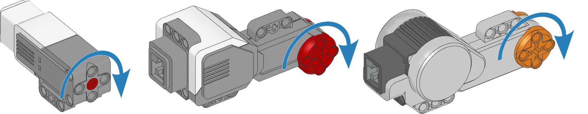

.. pybricks-requirements:: ev3devices nxtdevices

Motors with rotation sensors
^^^^^^^^^^^^^^^^^^^^^^^^^^^^

.. _fig_nxtmotors:

   EV3 and NXT motors with rotation sensors. The arrows indicate the default
   positive direction.

.. blockimg:: pybricks_variables_set_motor

.. autoclass:: pybricks.nxtdevices.Motor
    :no-members:
    :no-index:

    .. include:: ../common/motor_members.rst.txt
