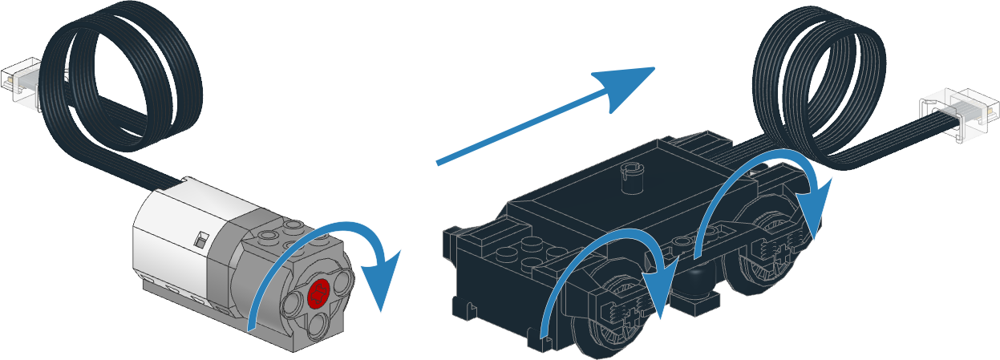

.. pybricks-requirements::

Motors without rotation sensors
^^^^^^^^^^^^^^^^^^^^^^^^^^^^^^^

.. _fig_pupdcmotors:

   Powered Up motors without rotation sensors. The arrows indicate the default
   positive direction.

.. blockimg:: pybricks_variables_set_dc_motor

.. autoclass:: pybricks.pupdevices.DCMotor
    :no-members:

    .. blockimg:: pybricks_blockMotorDuty_DCMotor

    .. automethod:: pybricks.pupdevices.DCMotor.dc
        :noindex:

    .. blockimg:: pybricks_blockMotorStop_DCMotor_coast

    .. automethod:: pybricks.pupdevices.DCMotor.stop
        :noindex:

    .. blockimg:: pybricks_blockMotorStop_DCMotor_brake

    .. automethod:: pybricks.pupdevices.DCMotor.brake
        :noindex:

    .. automethod:: pybricks.pupdevices.DCMotor.settings
        :noindex:

Examples
-------------------

Making a train drive forever
************************************

.. literalinclude::
    ../../../examples/pup/motor_dc/motor_dc_battery_box.py

Making the motor move back and forth
************************************

.. literalinclude::
    ../../../examples/pup/motor_dc/motor_dc_init_basic.py

Changing the positive direction
*******************************

.. literalinclude::
    ../../../examples/pup/motor_dc/motor_dc_init_direction.py

Starting and stopping
*********************

.. literalinclude::
    ../../../examples/pup/motor_dc/motor_dc_stop.py
