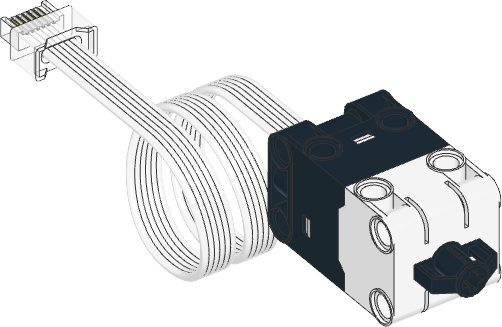

.. pybricks-requirements::

Force Sensor
^^^^^^^^^^^^^^^^^^^^^^^^^

.. blockimg:: pybricks_variables_set_force_sensor

.. autoclass:: pybricks.pupdevices.ForceSensor
    :no-members:

    .. blockimg:: pybricks_blockForce_ForceSensor

    .. automethod:: pybricks.pupdevices.ForceSensor.force

    .. blockimg:: pybricks_blockDistance_ForceSensor

    .. automethod:: pybricks.pupdevices.ForceSensor.distance

    .. automethod:: pybricks.pupdevices.ForceSensor.pressed

    .. automethod:: pybricks.pupdevices.ForceSensor.touched

Examples
-------------------

Measuring force and movement
****************************

.. literalinclude::
    ../../../examples/pup/sensor_force/basics.py

Measuring peak force
********************

.. literalinclude::
    ../../../examples/pup/sensor_force/peak.py
