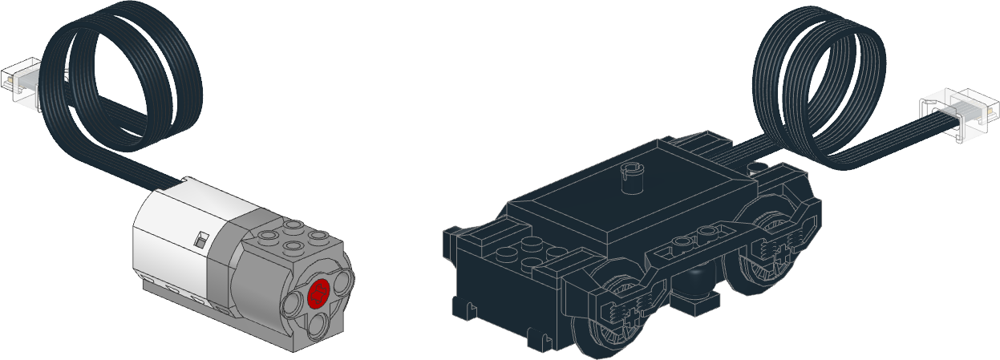
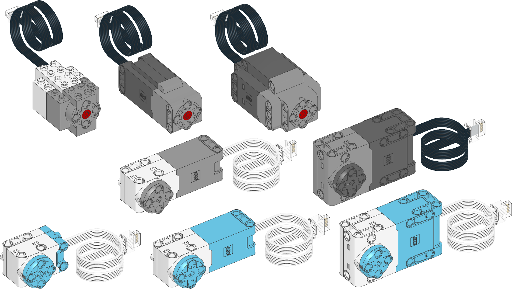
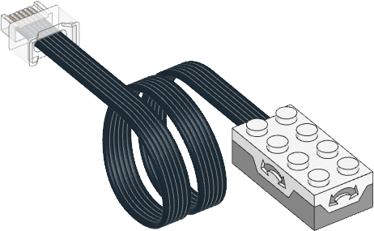
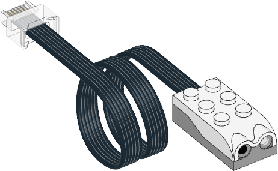
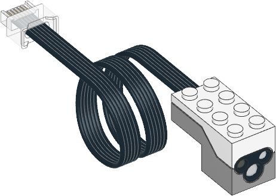
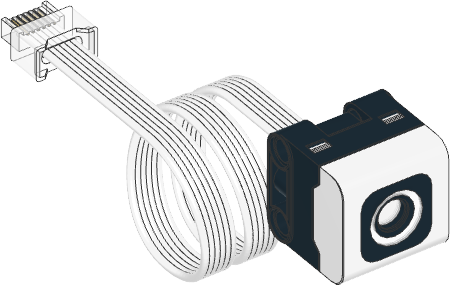
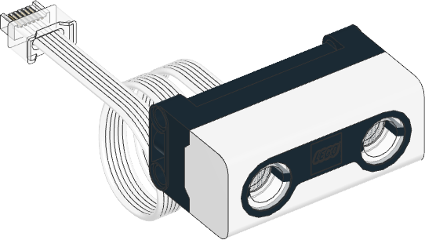
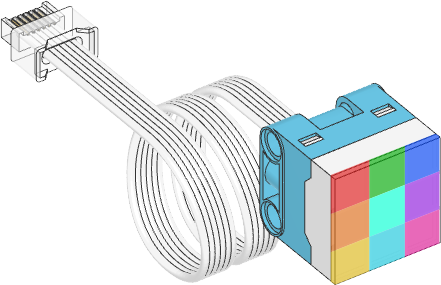
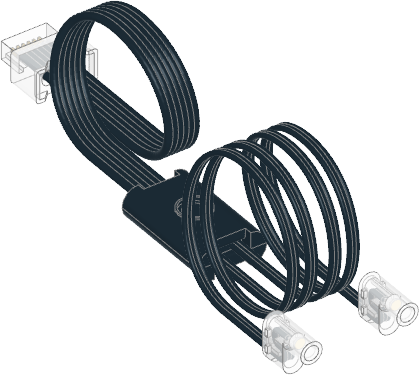
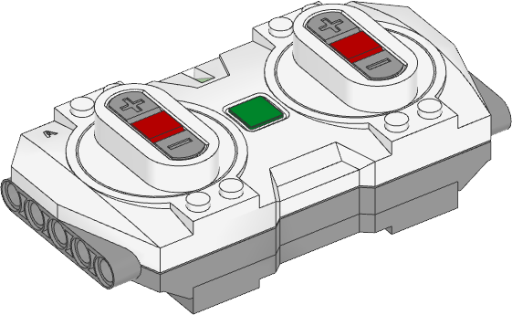

.. pybricks-requirements::

:mod:`pupdevices <pybricks.pupdevices>` -- Motors, sensors, lights
==================================================================

.. automodule:: pybricks.pupdevices
    :no-members:

.. toctree::
   :maxdepth: 1
   :hidden:

   dcmotor
   motor
   tiltsensor
   infraredsensor
   colordistancesensor
   pfmotor
   colorsensor
   ultrasonicsensor
   forcesensor
   colorlightmatrix
   light
   remote

.. pybricks-classlink:: DCMotor

.. pybricks-classlink:: Motor

.. pybricks-classlink:: TiltSensor

.. pybricks-classlink:: InfraredSensor

.. pybricks-classlink:: ColorDistanceSensor

.. pybricks-classlink:: PFMotor

.. figure:: ../../main/cad/output/pupdevice-pfmotor.png
   :width: 95 %
   :target: pfmotor.html

.. pybricks-classlink:: ColorSensor

.. pybricks-classlink:: UltrasonicSensor

.. pybricks-classlink:: ForceSensor

.. figure:: ../../main/cad/output/pupdevice-force.png
   :width: 35 %
   :target: forcesensor.html

.. pybricks-classlink:: ColorLightMatrix

.. pybricks-classlink:: Light

.. pybricks-classlink:: Remote

