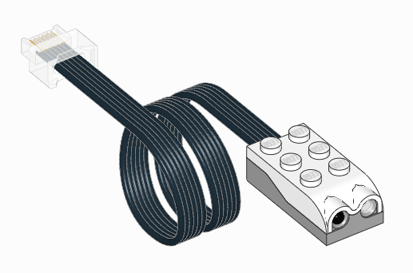
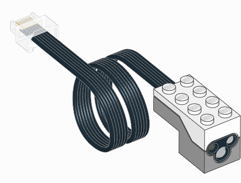
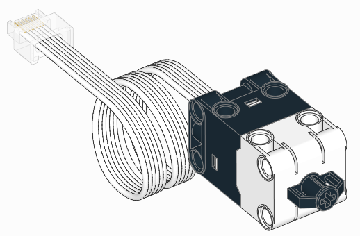
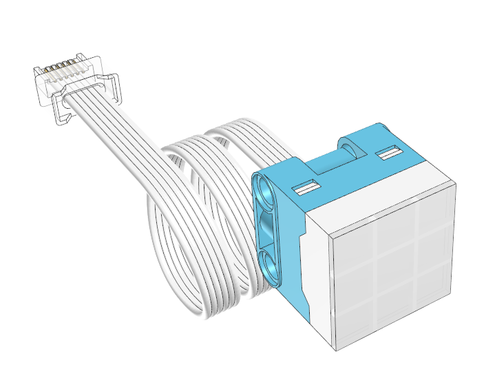

.. pybricks-requirements::

:mod:`pupdevices <pybricks.pupdevices>` -- Powered Up devices
=============================================================

.. automodule:: pybricks.pupdevices
    :no-members:

.. toctree::
   :maxdepth: 1
   :hidden:

   dcmotor
   motor
   tiltsensor
   infraredsensor
   colordistancesensor
   pfmotor
   colorsensor
   ultrasonicsensor
   forcesensor
   colorlightmatrix
   light
   remote

.. pybricks-classlink:: DCMotor

.. figure:: ../../main/images/pupdcmotors_label.png
    :width: 70 %
    :target: dcmotor.html

.. pybricks-classlink:: Motor

.. figure:: ../../main/images/pupmotors_label.png
    :width: 100 %
    :target: motor.html

.. pybricks-classlink:: TiltSensor

.. figure:: ../../main/images/sensor_tilt.png
   :width: 35 %
   :target: tiltsensor.html

.. pybricks-classlink:: InfraredSensor

.. pybricks-classlink:: ColorDistanceSensor

.. pybricks-classlink:: PFMotor

.. figure:: ../../main/images/pfmotor.png
   :width: 95 %
   :target: pfmotor.html

.. pybricks-classlink:: ColorSensor

.. figure:: ../../main/images/sensor_color.png
   :width: 32 %
   :target: colorsensor.html

.. pybricks-classlink:: UltrasonicSensor

.. figure:: ../../main/images/sensor_ultrasonic.png
   :width: 37 %
   :target: ultrasonicsensor.html

.. pybricks-classlink:: ForceSensor

.. pybricks-classlink:: ColorLightMatrix

.. pybricks-classlink:: Light

.. figure:: ../../main/images/light.png
   :width: 90 %
   :target: light.html

.. pybricks-classlink:: Remote

.. figure:: ../../main/images/pupremote.png
   :width: 50 %
   :target: remote.html
