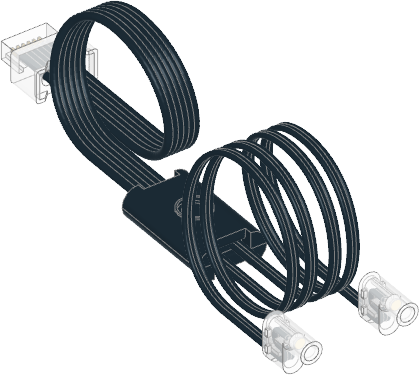

.. pybricks-requirements::

Light
^^^^^^^^^^^^^^^^^^^^^^^^^

.. blockimg:: pybricks_variables_set_light

.. autoclass:: pybricks.pupdevices.Light
    :no-members:

    .. blockimg:: pybricks_blockLightOn_light_on

    .. automethod:: pybricks.pupdevices.Light.on

    .. blockimg:: pybricks_blockLightOn_light_off

    .. automethod:: pybricks.pupdevices.Light.off

Examples
-------------------

Making the light blink
**********************

.. literalinclude::
    ../../../examples/pup/light/basics.py

Gradually change the brightness
*******************************

.. literalinclude::
    ../../../examples/pup/light/math.py
