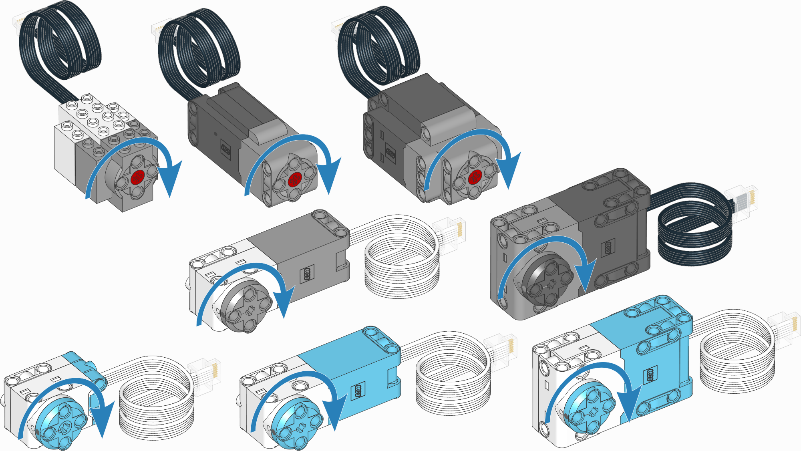

.. pybricks-requirements::

Motors with Rotation Sensors
^^^^^^^^^^^^^^^^^^^^^^^^^^^^

.. _fig_pupmotors:

   Powered Up motors with rotation sensors. The arrows indicate the default
   positive direction. See the :mod:`hubs <pybricks.hubs>` module for default
   directions of built-in motors.

.. autoclass:: pybricks.pupdevices.Motor
    :no-members:

    .. rubric:: Measuring

    .. automethod:: pybricks.pupdevices.Motor.speed

    .. automethod:: pybricks.pupdevices.Motor.angle

    .. automethod:: pybricks.pupdevices.Motor.reset_angle

    .. rubric:: Stopping

    .. automethod:: pybricks.pupdevices.Motor.stop

    .. automethod:: pybricks.pupdevices.Motor.brake

    .. automethod:: pybricks.pupdevices.Motor.hold

    .. rubric:: Action

    .. automethod:: pybricks.pupdevices.Motor.run

    .. automethod:: pybricks.pupdevices.Motor.run_time

    .. automethod:: pybricks.pupdevices.Motor.run_angle

    .. automethod:: pybricks.pupdevices.Motor.run_target

    .. automethod:: pybricks.pupdevices.Motor.track_target

    .. automethod:: pybricks.pupdevices.Motor.run_until_stalled

    .. automethod:: pybricks.pupdevices.Motor.dc

    .. _settings:

    .. rubric:: Motor status

    .. attribute:: control.scale

        Number of degrees that the motor turns to complete one degree at the
        output of the gear train. This is the gear ratio determined from the
        ``gears`` argument when initializing the motor.

    .. automethod:: pybricks.pupdevices.Motor.control.done

    .. automethod:: pybricks.pupdevices.Motor.control.stalled

    .. automethod:: pybricks.pupdevices.Motor.control.load

    .. rubric:: Motor settings

    You can only change these settings while the controller is stopped. For
    example, you can change them at the start of your program. Alternatively,
    first call :meth:`stop() <pybricks.pupdevices.Motor.stop>`, and then change the settings.

    .. automethod:: pybricks.pupdevices.Motor.control.limits

    .. automethod:: pybricks.pupdevices.Motor.control.pid

    .. automethod:: pybricks.pupdevices.Motor.control.target_tolerances

    .. automethod:: pybricks.pupdevices.Motor.control.stall_tolerances

Initialization Examples
-----------------------

Making the motor move back and forth
*******************************************************

.. literalinclude::
    ../../../examples/pup/motor/motor_init_basic.py

Initializing multiple motors
*******************************************************

.. literalinclude::
    ../../../examples/pup/motor/motor_init_multiple.py

Setting the positive direction as counterclockwise
*******************************************************

.. literalinclude::
    ../../../examples/pup/motor/motor_init_direction.py

Using gears
*******************************************************

.. literalinclude::
    ../../../examples/pup/motor/motor_init_gears.py

Measurement Examples
-----------------------

Measuring the angle and speed
*******************************************************

.. literalinclude::
    ../../../examples/pup/motor/motor_measure.py

Resetting the measured angle
*******************************************************

.. literalinclude::
    ../../../examples/pup/motor/motor_reset_angle.py

Movement Examples
-----------------------

Basic usage of all run methods
*******************************************************

.. literalinclude::
    ../../../examples/pup/motor/motor_action_basic.py

Stopping ongoing movements in different ways
*******************************************************

.. literalinclude::
    ../../../examples/pup/motor/motor_stop.py

Using the ``then`` argument to change how a run command stops
*************************************************************

.. literalinclude::
    ../../../examples/pup/motor/motor_action_then.py

Stall Examples
-----------------------

Running a motor until a mechanical endpoint
*******************************************************

.. literalinclude::
    ../../../examples/pup/motor/motor_until_stalled.py

Centering a steering mechanism
*******************************************************

.. literalinclude::
    ../../../examples/pup/motor/motor_until_stalled.py

Parallel Movement Examples
--------------------------

Using the ``wait`` argument to run motors in parallel
*********************************************************

.. literalinclude::
    ../../../examples/pup/motor/motor_action_wait.py

Waiting for two parallel actions to complete
*******************************************************

.. literalinclude::
    ../../../examples/pup/motor/motor_action_wait_advanced.py
