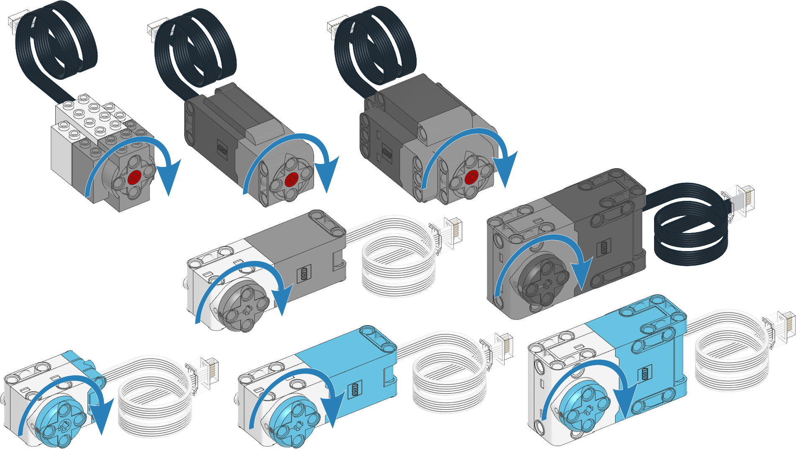

.. pybricks-requirements:: pupdevices

Motors with rotation sensors
^^^^^^^^^^^^^^^^^^^^^^^^^^^^

.. _fig_pupmotors:

   Powered Up motors with rotation sensors. The arrows indicate the default
   positive direction. See the :mod:`hubs <pybricks.hubs>` module for default
   directions of built-in motors.

.. blockimg:: pybricks_variables_set_motor

.. autoclass:: pybricks.pupdevices.Motor
    :no-members:

    .. include:: ../common/motor_members.rst.txt

Initialization examples
-----------------------

Making the motor move back and forth
*******************************************************

.. literalinclude::
    ../../../examples/pup/motor/motor_init_basic.py

Initializing multiple motors
*******************************************************

.. literalinclude::
    ../../../examples/pup/motor/motor_init_multiple.py

Setting the positive direction as counterclockwise
*******************************************************

.. literalinclude::
    ../../../examples/pup/motor/motor_init_direction.py

Using gears
*******************************************************

.. literalinclude::
    ../../../examples/pup/motor/motor_init_gears.py

Measurement examples
-----------------------

Measuring the angle and speed
*******************************************************

.. literalinclude::
    ../../../examples/pup/motor/motor_measure.py

Resetting the measured angle
*******************************************************

.. literalinclude::
    ../../../examples/pup/motor/motor_reset_angle.py

Getting the absolute angle
*******************************************************

.. literalinclude::
    ../../../examples/pup/motor/motor_absolute.py

Movement examples
-----------------------

Basic usage of all run methods
*******************************************************

.. literalinclude::
    ../../../examples/pup/motor/motor_action_basic.py

Stopping ongoing movements in different ways
*******************************************************

.. literalinclude::
    ../../../examples/pup/motor/motor_stop.py

Using the ``then`` argument to change how a run command stops
*************************************************************

.. literalinclude::
    ../../../examples/pup/motor/motor_action_then.py

Stall examples
-----------------------

Running a motor until a mechanical endpoint
*******************************************************

.. literalinclude::
    ../../../examples/pup/motor/motor_until_stalled.py

Centering a steering mechanism
*******************************************************

.. literalinclude::
    ../../../examples/pup/motor/motor_until_stalled_center.py

Parallel movement examples
--------------------------

Using the ``wait`` argument to run motors in parallel
*********************************************************

.. literalinclude::
    ../../../examples/pup/motor/motor_action_wait.py

Waiting for two parallel actions to complete
*******************************************************

.. literalinclude::
    ../../../examples/pup/motor/motor_action_wait_advanced.py
