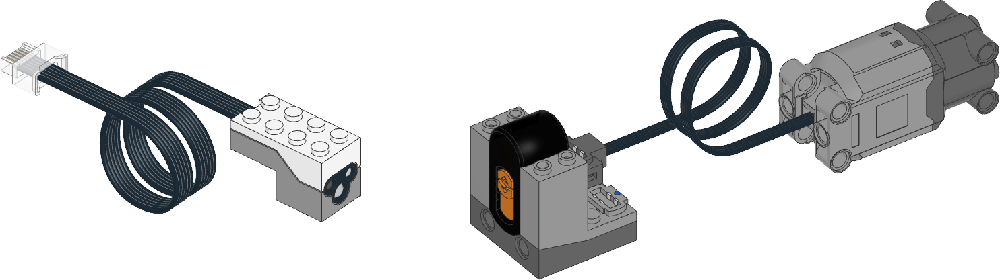

.. pybricks-requirements::

Power Functions
^^^^^^^^^^^^^^^^^^^^^^^^^

The :class:`ColorDistanceSensor <pybricks.pupdevices.ColorDistanceSensor>` can
send infrared signals to control Power Functions infrared receivers. You can
use this technique to control medium, large, extra large, and train
motors. The infrared range is limited to about 30 cm, depending on the angle
and ambient conditions.

   Powered Up
   :class:`ColorDistanceSensor <pybricks.pupdevices.ColorDistanceSensor>`
   (left), Power Functions infrared receiver (middle), and a Power Functions
   motor (right). Here, the receiver uses channel
   1 with a motor on the red port.

.. blockimg:: pybricks_variables_set_pf_motor

.. autoclass:: pybricks.pupdevices.PFMotor
    :noindex:
    :no-members:

    .. blockimg:: pybricks_blockMotorDuty_PFMotor

    .. automethod:: pybricks.pupdevices.PFMotor.dc
        :noindex:

    .. blockimg:: pybricks_blockMotorStop_PFMotor_coast

    .. automethod:: pybricks.pupdevices.PFMotor.stop
        :noindex:

    .. blockimg:: pybricks_blockMotorStop_PFMotor_brake

    .. automethod:: pybricks.pupdevices.PFMotor.brake
        :noindex:

Examples
-------------------

Control a Power Functions motor
*******************************

.. literalinclude::
    ../../../examples/pup/motor_pf/motor_pf_basics.py

Controlling multiple Power Functions motors
*******************************************

.. literalinclude::
    ../../../examples/pup/motor_pf/motor_pf_pwm.py
